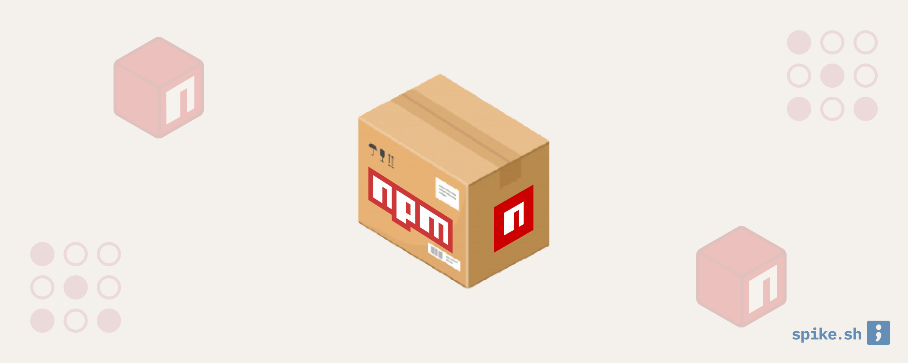
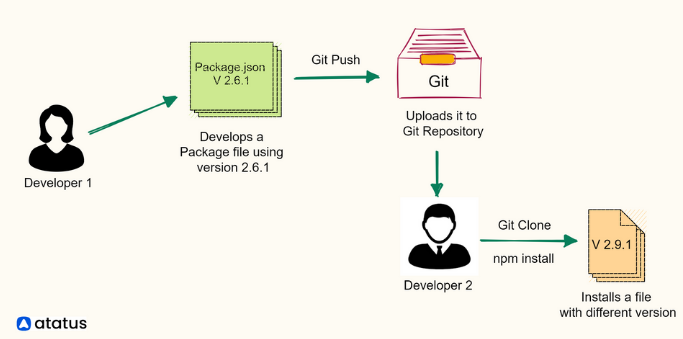
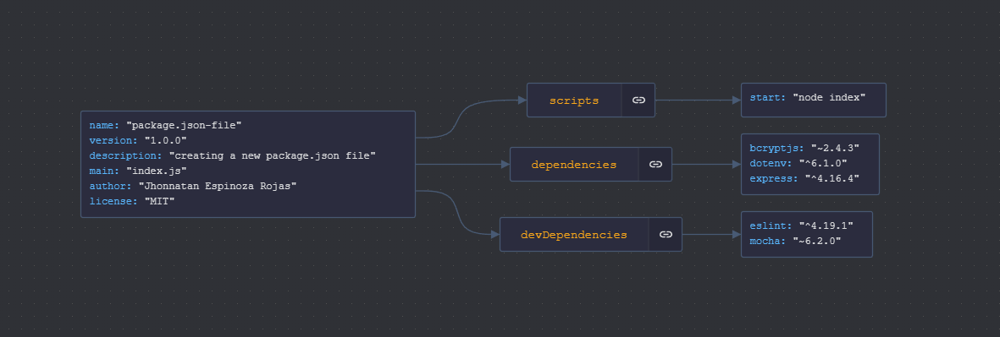
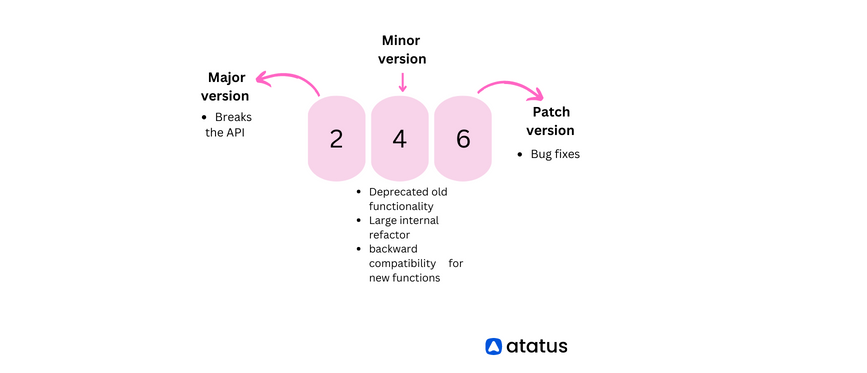
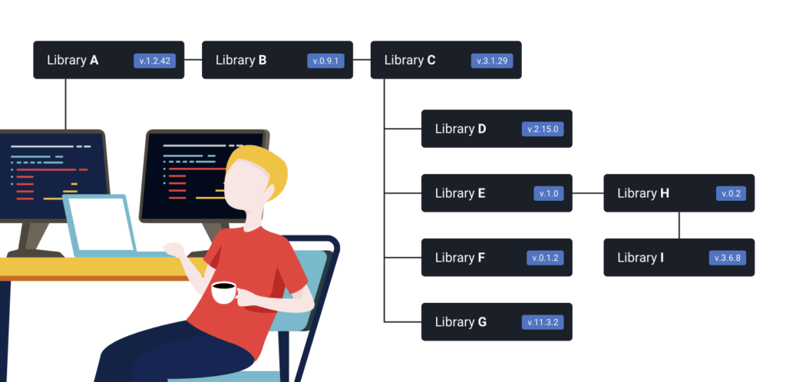
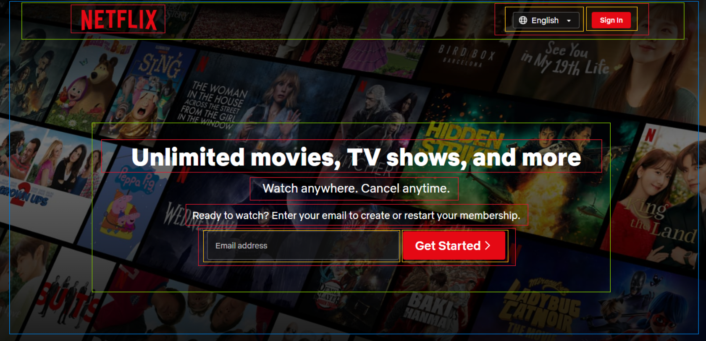

# Sesión 2 - Introducción a NodeJS: Creación de Proyectos, instalación de paquetes y Gestión de Dependencias

## ¿Qué es Node.js?


**Node.js** es un entorno de ejecución de código JavaScript que se basa en el motor V8 de Google Chrome. A diferencia de JavaScript en el navegador, que generalmente se utiliza para interactuar con el DOM y crear experiencias interactivas en la web, Node.js se enfoca en permitir que el JavaScript se ejecute en el servidor, lo que significa que puede realizar tareas de servidor y acceder a recursos del sistema.

## ¿Qué es un paquete?



Un paquete es una colección de archivos y directorios que contienen código JavaScript, junto con un archivo `package.json` que describe los detalles del paquete, como su nombre, versión, dependencias y otros metadatos.

## ¿Que es un package.json?



`package.json` es un archivo de metadatos en un proyecto de Node.js que describe las dependencias, scripts, configuraciones y otros detalles del proyecto.

Por lo general, contiene información sobre el proyecto, como su nombre, versión, autor y licencia. También enumera las dependencias del proyecto en otros paquetes de Node.js, junto con sus números de versión, de modo que estas dependencias puedan instalarse automáticamente al configurar o actualizar el proyecto.

El archivo `package.json` generalmente se encuentra en el directorio raíz de un proyecto de Node.js y se genera automáticamente cuando ejecutas el comando `npm init` para inicializar un nuevo proyecto. También puedes crear y modificar manualmente este archivo para gestionar las dependencias y la configuración de tu proyecto.

Este archivo es esencial para los proyectos de Node.js, ya que proporciona una manera estandarizada de gestionar dependencias y definir la configuración del proyecto, lo que facilita compartir y colaborar en proyectos con otros.

### Estrucutra de un archivo package.json



Ejemplo de un archivo `package.json`:

```json
{
    "name": "my-project",
    "version": "1.0.0",
    "description": "A description of my project",
    "main": "index.js",
    "scripts": {
    "start": "node index.js"
    },
    "author": "Jhonnatan Espinoza Rojas",
    "license": "MIT",
    "dependencies": {
        "bcryptjs": "~2.4.3",
        "dotenv": "^6.1.0",
        "express": "4.16.4"
    },
    "devDependencies": {
        "eslint": "^4.19.1",
        "mocha": "~6.2.0"
    }
}
```

Como se puede observar hay un conjunto definido de propiedades mencionadas en un archivo package.json. Ahora veremos en un poco más de detalle qué son estas propiedades.

- **Name:** El campo de nombre define el nombre del paquete. Debe estar en minúsculas y ser una sola palabra. Puede tener hasta 214 caracteres de longitud. Puede contener guiones bajos y guiones, pero no espacios ni otros caracteres especiales. Tener un nombre para el archivo es obligatorio, de lo contrario, generará un mensaje de error.
- **Version:** Describe la versión actual de JSON que se está utilizando en el programa. Este campo también es esencial en caso de publicar el archivo. Está basado en el versionamiento semántico.
- **Description:** Esta cadena es útil para los usuarios al acceder al registro de NPM. Te dice de qué se trata el paquete.
- **Main:** Normalmente es un archivo `index.js` en la raíz de tu proyecto, pero puede ser cualquier archivo que elijas utilizar como punto de entrada principal para tu paquete.
- **Scripts:** Este campo es un objeto que contiene un conjunto de comandos que se pueden ejecutar desde la terminal. Por ejemplo, `npm start` ejecuta el comando `node index.js` definido en el campo `scripts`.
- **Author:** El campo de autor define el nombre del autor del paquete.
- **License:** El campo de licencia define la licencia del paquete.
- **Dependencies:** El campo de dependencias define las dependencias del paquete. Estas dependencias se instalan automáticamente cuando se instala el paquete.
- **DevDependencies:** El campo de dependencias de desarrollo define las dependencias de desarrollo del paquete. Estas dependencias se instalan automáticamente cuando se instala el paquete, pero no cuando se instala el paquete en modo de producción.

Existen otras propiedades que se pueden definir en el archivo `package.json`, pero las mencionadas anteriormente son las más comunes.

> **Nota:** Mas información sobre el archivo `package.json` en la documentación oficial de [npm](https://docs.npmjs.com/files/package.json).

### ¿Cuál es el propósito del archivo package.json en Node.js?

Aquí están algunos de los propósitos principales del archivo package.json en Node.js:

1. **Gestión de dependencias:** El archivo `package.json` especifica las `dependencies` y `devDependencies` requeridas por el proyecto, así como sus rangos de versión.
2. **Metadatos:** El archivo contiene metadatos sobre el proyecto, como el nombre, versión, descripción, autor, licencia y otra información relevante.
3. **Scripts:** Puede definir scripts que se pueden ejecutar utilizando el comando npm run, como build, test, start y otros.
4. **Configuración:** El archivo package.json se puede utilizar para configurar varios aspectos del proyecto, como el punto de entrada principal, el repositorio, los motores requeridos para ejecutar el proyecto y más.
5. **Publicación:** Si el proyecto está destinado a ser publicado en el registro de npm, el archivo package.json proporciona información sobre cómo debe publicarse el paquete, como el nombre, la versión, el autor, la licencia y otra información relevante.
6. **Compatibilidad:** El archivo package.json puede especificar el rango de versiones de Node.js con el que el proyecto es compatible, lo que puede ayudar a garantizar que el proyecto se ejecute correctamente en diferentes versiones de Node.js.

### Tilde (~) y caret (^), y sus diferencias



Las versiones de npm se escriben en el formato 0.0.0, donde el primer número (de izquierda a derecha) representa la versión **principal**, el segundo la **versión menor** y el tercero la última **versión de parche** de esa versión particular.

Las actualizaciones de parche se refieren a correcciones de errores. En el archivo package.json, esta representación se lleva a cabo mediante el símbolo \~. El tilde (\~) bloquea todas las versiones principales y menores anteriores. De esta manera, solo permite instalar la última versión parcheada cuando estás instalando esta dependencia en particular.

La notación del caret (^) se utiliza para actualizar automáticamente las actualizaciones menores y las actualizaciones de parche. Por ejemplo, ^1.2.0 se actualizará a 1.3.1 (si se publica la próxima versión menor de parche de esa manera), lo que nos proporcionará una solución 1.X.X.

Si no se utiliza ni el símbolo ~ (tilde) ni el símbolo ^ (caret) junto a la versión de una dependencia, esto indica que se está fijando específicamente a la versión exacta que se ha especificado.

> **Nota:** Usar una versión exacta puede ser útil cuando deseas asegurarte de que tu proyecto siempre utilice una versión específica y probada de una dependencia. Sin embargo, también es importante recordar que esto podría llevar a no aprovechar las mejoras y correcciones de errores que se introduzcan en versiones posteriores.

## ¿Qué es un módulo?



Un módulo es un archivo o directorio que contiene código JavaScript y se puede reutilizar en otras partes de un proyecto. Los módulos son una parte esencial de Node.js, ya que permiten dividir el código en piezas más pequeñas y fáciles de mantener.

### ¿Que es node_modules?

`node_modules` es un directorio que contiene todos los paquetes de Node.js instalados en un proyecto. Cada paquete se almacena en su propio directorio dentro de `node_modules`, junto con su archivo `package.json` y cualquier otro archivo relacionado con el paquete.

## Comandos básicos de npm

### npm init

El comando `npm init` se utiliza para inicializar un proyecto de Node.js y generar un archivo `package.json` en el directorio raíz del proyecto. Este comando le solicitará que ingrese algunos detalles sobre el proyecto, como el nombre, la versión, la descripción, el punto de entrada principal, el autor, la licencia y más.

```bash
npm init
```

### npm install

El comando `npm install` se utiliza para instalar paquetes de Node.js en un proyecto. Este comando instala todos los paquetes especificados en el archivo `package.json` en el directorio `node_modules` del proyecto.

```bash
npm install <package_name>
```

> **Nota:** Una forma alternativa de instalar dependencias es utilizando el comando `npm i <package_name>`.

### npm install --save

El comando `npm install --save` se utiliza para instalar paquetes de Node.js en un proyecto y guardarlos como dependencias en el archivo `package.json`. Este comando instala todos los paquetes especificados en el archivo `package.json` en el directorio `node_modules` del proyecto y guarda las dependencias en el archivo `package.json`.

```bash
npm install --save <package_name>
```

> **Nota:** Una forma alternativa de instalar dependencias es utilizando el comando `npm install -S <package_name>`.

### npm install --save-dev

El comando `npm install --save-dev` se utiliza para instalar paquetes de Node.js en un proyecto y guardarlos como dependencias de desarrollo en el archivo `package.json`. Este comando instala todos los paquetes especificados en el archivo `package.json` en el directorio `node_modules` del proyecto y guarda las dependencias de desarrollo en el archivo `package.json`.

```bash
npm install --save-dev <package_name>
```

> **Nota:** Una forma alternativa de instalar dependencias de desarrollo es utilizando el comando `npm install -D <package_name>`.

### npm install --global

El comando `npm install --global` se utiliza para instalar paquetes de Node.js de forma global en el sistema. Este comando instala todos los paquetes especificados en el archivo `package.json` en el directorio `node_modules` del sistema.

```bash
npm install --global <package_name>
```

> **Nota:** Una forma alternativa de instalar dependencias de desarrollo es utilizando el comando `npm install -g <package_name>`.

### npm audit

El comando `npm audit` se utiliza para buscar vulnerabilidades en el proyecto. Este comando busca vulnerabilidades en el archivo `package.json` y en el directorio `node_modules` del proyecto.

```bash
npm audit
```

## Actividad Practica

### Creación del proyecto con Vite

Para crear un proyecto ReactJS con npm, se debe ejecutar el siguiente comando:

```bash
npm create vite@latest
```

Primero eliminamos el contenido de los archivos `App.css`, `main.css` y `App.jsx` ubicados en la carpeta `src`.

Ahora en el archivo App.jsx agregamos el siguiente código:

```jsx
import './App.css'

function App() {

    return (
        <>
            <h1>Hello world!</h1>
        </>
    )
}

export default App
```

Con esto ya tenemos creado nuestro proyecto con Vite.

### Instalación y configuración de ESLint

Ahora vamos a instalar ESLint para utilizarlo como linter en nuestro proyecto, para ello ejecutamos el siguiente comando:

```bash
npm install -D eslint
```

Luego configuramos eslint en nuestro proyecto ejecutando el siguiente comando:

```bash
npx eslint --init
```

Seleccionamos las siguientes opciones:

- To check syntax, find problems, and enforce code style
- JavaScript modules (import/export)
- React
- No use TypeScript
- Browser
- JSON

Ahora vamos a agregar nuestro primer script en el archivo `package.json`:

```json
{
  "scripts": {
    "lint": "eslint \"**/*.js\" --ignore-path .gitignore"
  }
}
```

Y ya podemos usar ESLint en nuestro proyecto.

Ejemplo de uso de ESLint:

```bash
npm run lint
```

### Instalación y configuración de Prettier

Ahora vamos a instalar Prettier para utilizarlo como formateador de código en nuestro proyecto, para ello ejecutamos el siguiente comando:

```bash
npm install prettier eslint-config-prettier --save-dev
```

Ahora crearemos un archivo `.prettierrc.json` en la raíz de nuestro proyecto con el siguiente contenido:

```json
{
    "semi": false,
    "singleQuote": true,
    "tabWidth": 4,
    "useTabs": false,
    "trailingComma": "es5"
}
```

Luego agregamos la siguiente configuración en el archivo `.eslintrc.json`:

```json
{
    "extends": [
        "eslint:recommended",
        "prettier"
    ],
}
```

### Instalación y configuración de TailwindCSS

Ahora vamos a instalar tailwindcss para utilizarlo como framework de estilos en nuestro proyecto, para ello ejecutamos el siguiente comando:

```bash
npm install -D tailwindcss postcss autoprefixer
```

Ejecutamos el siguiente comando para crear el archivo de configuración de tailwindcss:

```bash
npx tailwindcss init -p
```

Luego configuramos nuestro archivo `tailwind.config.js` de la siguiente manera:

```js
/** @type {import('tailwindcss').Config} */
export default {
    content: [
        "./index.html",
        "./src/**/*.{js,ts,jsx,tsx}",
    ],
    theme: {
        extend: {},
    },
    plugins: [],
}
```

Finalmente agregamos el siguiente código al archivo `index.css`:

```css
@tailwind base;
@tailwind components;
@tailwind utilities;
```

Y ya podemos usar tailwindcss en nuestro proyecto.

Ejemplo de uso de tailwindcss:

```jsx
export default function App() {
  return (
    <h1 className="text-3xl font-bold underline">
      Hello world!
    </h1>
  )
}
```

## Actividad de reforzamiento

Crear un proyecto con Vite e instalar las dependencias React-Icons, Prettier y TailwindCSS para crear la siguiente vista en react


Para ello necesitaremos usar iconos y fuentes ya proporcionados en la carpeta public con la siguiente estructura.

```bash
public
├── fonts
│   ├── NetflixSans-Bold.woff2
│   ├── NetflixSans-Light.woff2
│   ├── NetflixSans-Medium.woff2
│   └── NetflixSans-Regular.woff2
├── icons
│   └── netflix.svg
└── imgs
    └── background.jpg
```

## Solución de la actividad de reforzamiento

Primero podemos analizar la estructura de la vista en el siguiente diagrama:



Luego procedemos ah agregar las fuentes a nuestro archivo `index.css`:

```css
@layer base {
    html {
        font-family: 'NetflixSans';
    }
}

@font-face {
    font-family: 'NetflixSans';
    src: url('/fonts/NetflixSans-Light.woff2') format('woff2');
    font-weight: 300;
    font-style: normal;
}

@font-face {
    font-family: 'NetflixSans';
    src: url('/fonts/NetflixSans-Regular.woff2') format('woff2');
    font-weight: 400;
    font-style: normal;
}

@font-face {
    font-family: 'NetflixSans';
    src: url('/fonts/NetflixSans-Medium.woff2') format('woff2');
    font-weight: 500;
    font-style: normal;
}

@font-face {
    font-family: 'NetflixSans';
    src: url('/fonts/NetflixSans-Bold.woff2') format('woff2');
    font-weight: 700;
    font-style: normal;
}
```

En nuesto archivo `App.css` agregamos los siguientes estilos:

```css
.background {
    background-image: url('/imgs/background.jpg');
    background-size: 125%;
}

.overlay {
    background-image: linear-gradient(
        to bottom,
        rgba(0, 0, 0, 0.90),
        rgba(0, 0, 0, 0.30),
        rgba(0, 0, 0, 0.90)
    );
}
```

Procedemos a definir los colores que usaremos en el archivo `tailwind.config.js`:

```js
/** @type {import('tailwindcss').Config} */
export default {
    content: ['./index.html', './src/**/*.{js,ts,jsx,tsx}'],
    theme: {
        extend: {
            colors:{
                red: '#e50914',
                white: '#ffffff',
                black: '#151515'
            }
        },
    },
    plugins: [],
}
```

Finalmente nuestro archivo `App.jsx` deberia verse de la siguiente forma:

```jsx
import { VscGlobe } from 'react-icons/vsc'
import { FaCaretDown, FaChevronRight } from 'react-icons/fa'

import './App.css'

function App() {
    return (
        <main className="relative flex flex-col h-screen w-screen">
            <div className="absolute z-0 inset-0 bg-center background"></div>
            <div className="absolute inset-0 z-0 overlay"></div>
            <header className="relative z-10 flex flex-row w-full justify-between select-none p-6 max-w-screen-xl mx-auto">
                    <a href="#">
                        
                    </a>
                    <div className="flex flex-row items-center gap-4">
                        <div className="relative flex flex-row items-center gap-4">
                            <VscGlobe size={20} fill="white" className='absolute z-10 left-2'/>
                            <FaCaretDown size={14} fill="white" className='absolute z-10 right-2' />
                            <select className='relative w-36 px-9 py-1 appearance-none rounded border text-white border-white border-opacity-25 bg-black bg-opacity-75'>
                                <option>English</option>
                                <option>Español</option>
                            </select>
                            
                        </div>
                        <a
                            href="#"
                            className="px-4 py-1 rounded select-none bg-red text-white">
                            <p>Sign In</p>
                        </a>
                    </div>
                </header>
                <section className="relative z-10 flex flex-col justify-center items-center gap-6 my-auto text-white">
                    <h1 className="text-5xl font-bold">
                        Unlimited movies, TV shows, and more
                    </h1>
                    <h2 className="text-2xl">Watch anywhere. Cancel anytime.</h2>
                    <h3 className="text-xl">
                        Ready to watch? Enter your email to create or restart
                        your membership.
                    </h3>
                    <form className="flex flex-row gap-2">
                        <input
                            type="text"
                            className="flex flex-row min-w-[375px] w-fit px-4 py-3 rounded border border-white border-opacity-25 bg-black bg-opacity-75 text-white"
                            placeholder="Email address"
                        />
                        <button
                            className="flex flex-row items-center gap-4 px-8 py-3 rounded select-none bg-red text-white">
                            <p className="font-medium text-2xl">Get Started</p>
                            <FaChevronRight />
                        </button>
                    </form>
                </section>
        </main>
    )
}

export default App
```

Con esto podemos concluir la actividad de reforzamiento.

## Bibliografía

1. [Npm Documentation](https://docs.npmjs.com/cli/v9/configuring-npm/package-json)
2. [package.json vs package.lock.json](https://www.atatus.com/blog/package-json-vs-package-lock-json)
