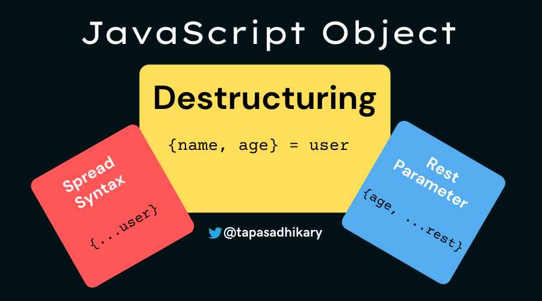
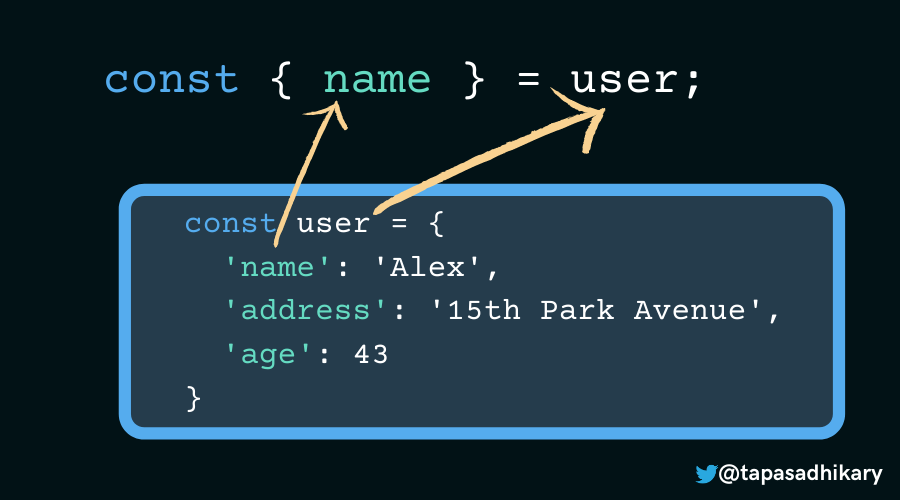
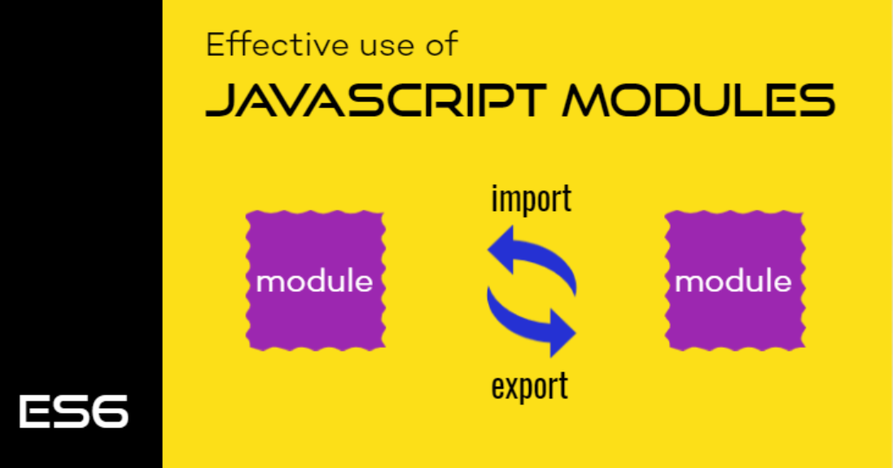
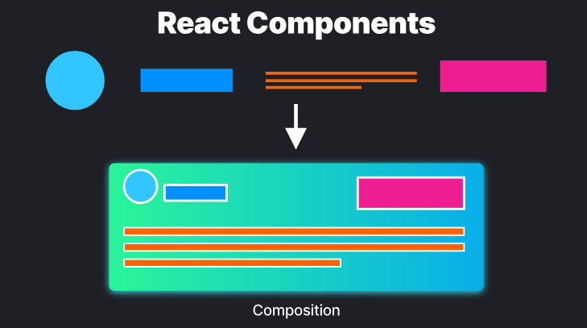
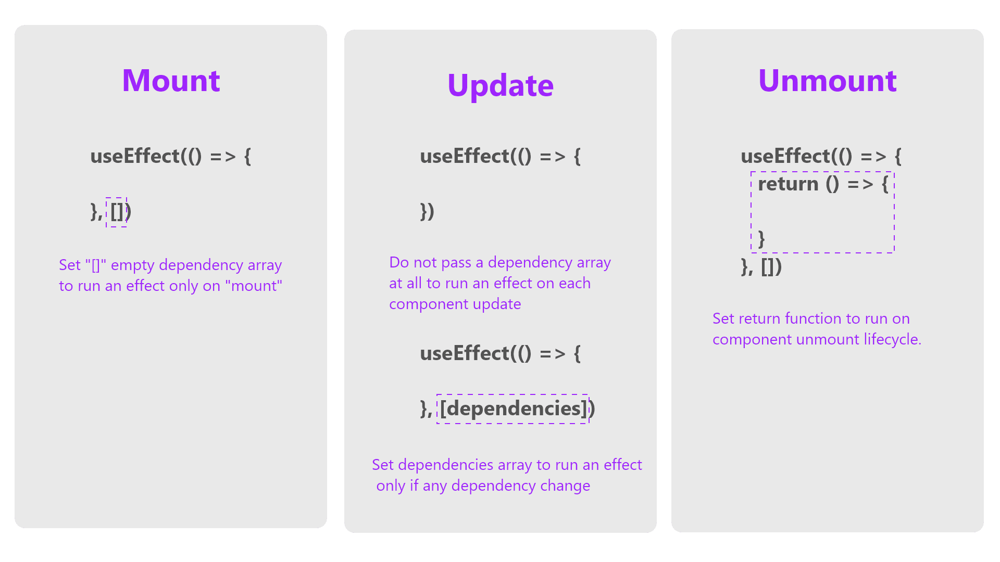
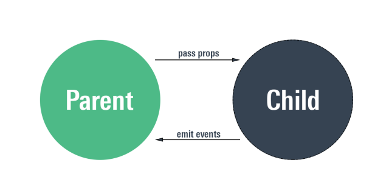

# Sesión 3 - Creacion de componentes en React: props, children y composición

Los componentes son la unidad básica de React, en esta sesión aprenderás a crear componentes en React utilizando funciones, a utilizar las propiedades de los componentes para pasar datos y funciones entre componentes y a utilizar la composición de componentes para crear componentes más complejos.


## Parametros rest y spread



### Parametros rest

Los parámetros rest son una característica de JavaScript que nos permite pasar un número variable de argumentos a una función. En React, los parámetros rest son una característica muy utilizada para pasar un número variable de propiedades a los componentes.

Por ejemplo, si tenemos una función que recibe un número variable de argumentos, podemos utilizar los parámetros rest para pasar un número variable de argumentos a la función de la siguiente manera:

```js
function sum (...args) {
    let res = 0;
    for( let arg of args) {
        res += arg;
    }
    return res;
}

sum(1, 2, 3, 4, 5); // 15
```

> Los parámetros rest deben ir al final de la lista de parámetros de una función.

### Parametros spread

Los parámetros spread son una característica de JavaScript que nos permite expandir un arreglo en elementos individuales. En React, los operadores spread son una característica muy utilizada para pasar elementos individuales de un arreglo como argumentos a una función.

Por ejemplo, si tenemos una función que recibe argumentos individuales, podemos utilizar los parámetros spread para pasar elementos individuales de un arreglo como argumentos a la función de la siguiente manera:

```js
function sum (a, b, c, d, e) {
    return a + b + c + d + e;
}

const numbers = [1, 2, 3, 4, 5, 6];

sum(...numbers); // 15
```

## Destructuración de objetos y arreglos



La destructuración es una característica de JavaScript que nos permite extraer datos de objetos y arreglos de una manera más sencilla y legible. En React, la destructuración es una característica muy utilizada para extraer las propiedades de los componentes y los elementos de los arreglos.

### Destructuración de objetos

La destructuración de objetos nos permite extraer las propiedades de un objeto y asignarlas a variables con el mismo nombre de la propiedad. Por ejemplo, si tenemos un objeto con las propiedades `name` y `age`, podemos extraer las propiedades del objeto de la siguiente manera:

```js
const person = {
  name: 'John Doe',
  age: 30,
};

const { name, age } = person;

console.log(name); // John Doe
console.log(age); // 30
```

### Destructuración de arreglos

La destructuración de arreglos nos permite extraer los elementos de un arreglo y asignarlos a variables con el mismo nombre de la posición del elemento. Por ejemplo, si tenemos un arreglo con los elementos `John Doe` y `30`, podemos extraer los elementos del arreglo de la siguiente manera:

```js
const person = [
    'John Doe', 
    30
];

const [ name, age ] = person;

console.log(name); // John Doe
console.log(age); // 30
```

## import y export



### export default

La sentencia `export default` se utiliza para exportar un objeto, función o archivo completo de un archivo de JavaScript para que pueda ser utilizado en otros archivos de JavaScript. La sentencia `import` se utiliza para importar un objeto, función o archivo completo de otros archivos de JavaScript.

Como ejemplo de `export default` y `import`, supongamos que tenemos un archivo llamado `utils.js` con la siguiente función:

```js
export default function sum (a, b) {
    return a + b
};
```

o también podemos exportar un objeto:

```js
function sum (a, b) {
    return a + b
};

export default sum;
```

Para utilizar la función `sum` en otro archivo de JavaScript, podemos importarla de la siguiente manera:

```js
import sum from './utilities/utils.js';

console.log(sum(2, 3)); // 5
```

### export sin default

La sentencia `export` sin default se utiliza para exportar múltiples objetos, funciones o archivos completos de un archivo de JavaScript para que puedan ser utilizados en otros archivos de JavaScript. La sentencia `import` se utiliza para importar múltiples objetos, funciones o archivos completos de otros archivos de JavaScript.

Como ejemplo de `import` y `export`, supongamos que tenemos un archivo llamado `utils.js` con las siguientes funciones:

```js
export function sum (a, b) {
    return a + b
};

export function rest (a, b) {
    return a - b
};

export function multiply (a, b) {
    return a * b
};
```

Para utilizar las funciones `sum` y `multiply` en otro archivo de JavaScript, podemos importarlas de la siguiente manera:

```js
import { sum, multiply } from './utilities/utils.js';

console.log(sum(2, 3)); // 5
console.log(multiply(2, 3)); // 6
```

## Componentes



### Ciclo de vida de los componentes



Los componentes de React tienen un ciclo de vida que consta de tres fases: montaje, actualización y desmontaje. En la fase de montaje, el componente se crea e inserta en el DOM. En la fase de actualización, el componente se actualiza y vuelve a renderizarse en el DOM. En la fase de desmontaje, el componente se elimina del DOM.

### Creacion de componentes


Para crear componentes en React, podemos utilizar funciones o clases. En esta sesión, aprenderemos a crear componentes utilizando funciones.

#### Componentes funcionales

Los componentes funcionales son funciones de JavaScript que reciben un objeto de propiedades y devuelven un elemento de React.

Por ejemplo, podemos crear un componente funcional llamado `Title` que devuelva un elemento `h1` de React de la siguiente manera:

```jsx
import React from 'react';

function Hello () {
    return <h1>Hello World</h1>
}

export default Title;
```

> Por convención, los componentes funcionales se nombran con la primera letra en mayúscula.

#### Componentes de clase

Los componentes de clase son clases de JavaScript que extienden la clase `React.Component` y devuelven un elemento de React. Por ejemplo, podemos crear un componente de clase llamado `Title` que extienda la clase `React.Component` y devuelva un elemento `h1` de React de la siguiente manera:

```jsx
import React from 'react';

export class Title extends React.Component {
    render () {
        return <h1>Hello World</h1>
    }
}

export default Title;
```

> Aunque los componentes de clase siguen siendo compatibles, React recomienda utilizar componentes funcionales para crear componentes.

### Props



Cuando creamos un componente en React, podemos pasarle datos y funciones utilizando propiedades. Las propiedades son un objeto de JavaScript que contiene los datos y funciones que queremos pasar a un componente.

Por ejemplo, podemos crear un componente funcional llamado `Title` que reciba un objeto de propiedades y devuelva un elemento `h1` de React de la siguiente manera:

```jsx
import React from 'react';

function Title (props) {
    return <h1>{props.title}</h1>
}

export default Title;
```

Ahora vamos a utilizar el componente `Title` en otro componente de React:

```jsx
import Title from './components/Title';

function App () {
    return (
        <div>
            <Title title="Hello World" />
        </div>
    )
}
```

> Por convención, los componentes de React suelen almacenarse en la carpeta `src/components` ademas estos archivos suelen tener la extensión `.jsx` y el nombre del componente suele ser el mismo que el nombre del archivo.

### Children

Cuando creamos un componente en React, podemos pasarle elementos utilizando children. Los children son un objeto de JavaScript que contiene los elementos que queremos pasar a un componente.

Por ejemplo, podemos crear un componente funcional llamado `Title` que reciba un objeto de children y devuelva un elemento `h1` de React de la siguiente manera:

```jsx
import React from 'react';

function Title (props) {
    return <h1>{props.children}</h1>
}

export default Title;
```

Ahora vamos a utilizar el componente `Title` en otro componente de React:

```jsx
import Title from './components/Title';

function App () {
    return (
        <div>
            <Title>Hello World</Title>
        </div>
    )
}
```

### Desestructuración de props

Cuando creamos un componente en React, podemos utilizar la destructuración para extraer las propiedades y los elementos de children de un objeto de JavaScript.

Por ejemplo, podemos crear un componente funcional llamado `Title` que extraiga las propiedades y los elementos de children de un objeto de JavaScript y devuelva un elemento `h1` de React de la siguiente manera:

```jsx
import React from 'react';

function Title ({ className, children }) {
    return <h1 className={className}> {children}</h1>
}

export default Title;
```

Ahora vamos a utilizar el componente `Title` en otro componente de React:

```jsx
import Title from './components/Title';

function App () {
    return (
        <div>
            <Title className="text-5xl">Hello World</Title>
        </div>
    )
}
```

### DefaultProps

DefaultProps es una característica de React que nos permite asignar valores por defecto a las propiedades de los componentes de React. Por ejemplo, podemos utilizar DefaultProps para asignar un valor por defecto a una propiedad.

Para utilizar DefaultProps, podemos utilizar la propiedad `defaultProps` de un componente de React de la siguiente manera:

```jsx
import React from 'react';

function Title ({ className, children }) {
    return <h1 className={className}> {children}</h1>
}

Title.defaultProps = {
    className: "text-5xl",
}

export default Title;
```

### Composición de componentes

La composición de componentes es una técnica que consiste en crear componentes más complejos a partir de componentes más simples. Por ejemplo, podemos crear un componente funcional llamado `Header` que utilice 2 componentes más simples llamados `Title` y `Subtitle` y `Quote` de la siguiente manera:

```jsx
import React from 'react';

function Title ({ className }) {
    return <h1 className="text-5xl">{children}</h1>
}

function Subtitle ({ className, children }) {
    return <h2 className={className}>{children}</h2>
}

function Quote ({ children,...props }) {
    return <blockquote {...props} >{children}</blockquote>
}

function Header () {
    return (
        <header>
            <Title >Hello World</Title>
            <Subtitle className="text-5xl">Lorem ipsum dolor sit amet consectetur adipisicing elit.</Subtitle>
            <Quote className="text-5xl" style={{padding: "5px"}}>Lorem ipsum dolor sit amet consectetur adipisicing elit.</Quote>
        </header>
    )
}

export default Header;
```

> Lo recomendable es crear componentes generales y reutilizables que puedan ser utilizados en diferentes partes de la aplicación.

## Actividad Práctica

Vamo a crear un sitio web utilizando React y TailwindCSS. El sitio web va a tener una sola pagina con un sidebar y un contenido principal. El sidebar va a tener un foto y un menú con 5 links. El contenido principal va a tener un titulo, un subtitulo y una imagen.


### Creación del proyecto

Primero vamos a crear un nuevo proyecto en React utilizando `create vite@latest`

```bash
npm init vite@latest
```

y vamos a crearlo de la siguiente manera:

```bash
project-name: website-portfolio
select-framework: react
select-variant: JavaScript + SWC
```

> **Nota:** Ahora devemos limpiar el proyecto eliminando los archivos que no vamos a utilizar y borrando los css que no vamos a utilizar.

### Instalación de prettier

Luego vamos a instalar la herramienta  `prettier` para formatear el código de nuestro proyecto

```bash
npm install prettier eslint-config-prettier --save-dev
```

Ahora vamos a crear un archivo llamado `.prettierrc.json` con la siguiente configuración

```json
{
    "tabWidth": 4,
    "useTabs": true,
    "semi": true,
    "trailingComma": "es5",
    "singleQuote": true,
    "jsxSingleQuote": false,
    "jsxBracketSameLine": true,
}
```

y agregamos al archivo `.eslintrc.cjs` la siguiente configuración

```js
module.exports = {
    extends: [
        'prettier'
    ],
};
```

### Instalación de tailwindcss

Ahora vamos a instalar tailwindcss para darle estilo a nuestra aplicación

```bash
npm install tailwindcss postcss autoprefixer --save-dev
npx tailwindcss init -p
```

Agregaremos al archivo `tailwind.config.js` la siguiente configuración

```js
/** @type {import('tailwindcss').Config} */
export default {
    content: ['./index.html', './src/**/*.{js,jsx,ts,tsx}'],
    theme: {
        extend: {},
    },
    plugins: [],
};
```

Finalmente vamos a agregar al `index.css` las siguientes clases de tailwindcss

```css
@tailwind base;
@tailwind components;
@tailwind utilities;
```

### Instalación de react-icons

Ahora vamos a instalar `react-icons` para utilizar los iconos de fontawesome

```bash
npm install react-icons --save
```

### Configurando nuestro proyecto

Agregaremos a nuestra carpeta `public` una carpeta llamada `images` y dentro de esta carpeta vamos a agregar una imagen llamada `background.jpg` y otra imagen llamada `profile.jpg` proporcionadas en el repositorio de github.

Debido a que utilizaremos una imagen para nuestra seccion home, vamos a configurarla en nuestro `tailwind.config.js` de la siguiente manera:

```js
extend: {
    backgroundImage: {
        'hero': "url('/images/background.jpg')",
    },
},
```

Desactivaremos temporalmente dos advertencias de eslint en nuestro archivo `.eslintrc.cjs` de la siguiente manera:

```js
rules: {
        'react/prop-types': 'off',
        'react/jsx-uses-react': 'error',
    },
```

- `react/prop-types`: Esta regla nos permite validar las propiedades de nuestros componentes de React.
- `react/jsx-uses-react`: Esta regla nos permite validar si estamos utilizando la librería de React en nuestros componentes de React.

### Creacion de componentes funcionales

Dentro de `src` a crear una carpeta llamada `components` y dentro de esta carpeta vamos a crear las siguientes subcarpetas `common`, `layout` y `pages`.

Dentro de la carpeta `common` vamos a crear los siguientes componentes:

- `Navitem.jsx`
- `Profile.jsx`
- `Social.jsx`
- `Text.jsx`
- `Title.jsx`

Dentro de la carpeta `layout` vamos a crear los siguientes componentes:

- `Footer.jsx`
- `Header.jsx`
- `Navbar.jsx`
- `Sidebar.jsx`

Dentro de la carpeta `pages` vamos a crear los siguientes componentes:

- `About.jsx`
- `Home.jsx`

> **Nota:** El codigo de cada componente se encuentra en el repositorio de github.
