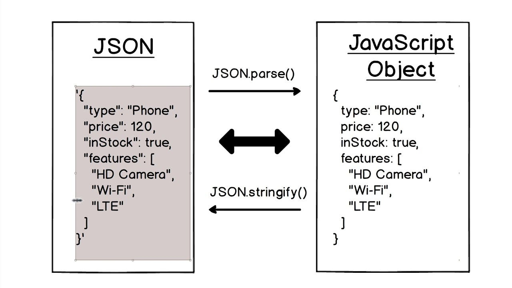

# Sesión 4 - Enrutamiento y manipulación de datos JSON

Bien llegado ah este punto del curso vamos a hablar un poco de el enrutamiento en react usando `react-router-dom` y como manipular datos JSON estaticos en nuestra aplicación.

## Javascript


### Funciones

Las funciones son un tipo de dato en javascript que nos permite ejecutar un bloque de código cuando se llame a la función. Por ejemplo:

```js
function saludar() {
    console.log("Hola mundo");
}
```

### Funciones flecha

Las funciones flecha son una forma de escribir funciones en javascript, estas funciones son muy utilizadas en React. Por ejemplo:

```js
const saludar = () => {
    console.log("Hola mundo");
};
```

### Operador ternario


El operador ternario es una forma de escribir un condicional en una sola línea. Por ejemplo:

```js
const numero = 5;

const resultado = numero > 10 ? "Es mayor" : "Es menor";
```

Abreviando asi el siguiente condicional:

```js
const numero = 5;

function condicion(numero) {
    if (numero > 10) {
        return "Es mayor";
    } else {
        return "Es menor";
    }
}

const resultado = condicion(numero);
```

### Manejo de Arreglos


Los arreglos son un tipo de dato en javascript que nos permite almacenar varios valores en una sola variable. Los arreglos tienen algunas propiedades y métodos que nos permiten manipularlos. Por ejemplo:

- `push` - Método que nos permite agregar un elemento al final de un arreglo.
- `pop` - Método que nos permite eliminar el último elemento de un arreglo.
- `splice` - Método que nos permite eliminar un elemento de un arreglo en una posición específica.
- `slice` - Método que nos permite obtener una parte de un arreglo.
- `map` - Método que nos permite recorrer un arreglo y retornar un nuevo arreglo con los elementos modificados.
- `filter` - Método que nos permite recorrer un arreglo y retornar un nuevo arreglo con los elementos que cumplan con una condición.
- `find` - Método que nos permite recorrer un arreglo y retornar el primer elemento que cumpla con una condición.
- `reduce` - Método que nos permite recorrer un arreglo y retornar un valor único.
- `join` - Método que nos permite unir los elementos de un arreglo en un string.

#### Método map

El método `map` nos permite recorrer un arreglo y retornar un nuevo arreglo con los elementos modificados. Por ejemplo:

```js
const numeros = [1, 2, 3, 4, 5];

const numerosDobles = numeros.map((numero) => numero * 2);
```

#### Método filter

El método `filter` nos permite recorrer un arreglo y retornar un nuevo arreglo con los elementos que cumplan con una condición. Por ejemplo:

```js
const numeros = [1, 2, 3, 4, 5];

const numerosPares = numeros.filter((numero) => numero % 2 === 0);
```

#### Método find

El método `find` nos permite recorrer un arreglo y retornar el primer elemento que cumpla con una condición. Por ejemplo:

```js
const numeros = [1, 2, 3, 4, 5];

const numeroTres = numeros.find((numero) => numero === 3);
```

#### Método reduce

El método `reduce` nos permite recorrer un arreglo y retornar un valor único. Por ejemplo:

```js
const numeros = [1, 2, 3, 4, 5];

const suma = numeros.reduce((acumulador, numero) => acumulador + numero, 0);
```

## Enrutamiento en React


El enrutamiento es una parte fundamental de cualquier aplicación web moderna, ya que nos permite crear rutas para acceder a diferentes secciones de nuestra aplicación. En React, podemos utilizar la biblioteca `react-router-dom` para crear rutas en nuestra aplicación.

Un ejemplo de rutas en una aplicación web es la siguiente:

- `/` - Ruta principal de la aplicación.
- `/blog` - Ruta para ver el blog de la aplicación.
- `/login` - Ruta para iniciar sesión en la aplicación.
- `/register` - Ruta para registrar un nuevo usuario en la aplicación, entre otras.

### Instalación de react-router-dom

Para instalar `react-router-dom` en nuestro proyecto, podemos utilizar el siguiente comando:

```bash
npm install react-router-dom --save
```

> **Nota:** El parámetro `--save` nos permite guardar la dependencia en el archivo `package.json` de nuestro proyecto.

### Creación de rutas

Para crear rutas en un proyecto React, nos dirigimos al archivo `main.jsx` y agregamos el siguiente código:

```jsx
import React from "react";
import ReactDOM from "react-dom/client";
import { createBrowserRouter, createRoutesFromElements, RouteProvider, Route } from "react-router-dom";
import App from "./App";
import "./index.css";

const router = createBrowserRouter(
    createRoutesFromElements(<Route path="/" element={<App />} />)
);

ReactDOM.createRoot(document.getElementById("root")).render(
    <React.StrictMode>
        <RouterProvider router={router} />
    </React.StrictMode>
);
```

### Ruta de error

Podemos crear una ruta de error para cuando el usuario ingrese una ruta que no existe en nuestra aplicación. Para crear una ruta de error, podemos agregar la propiedad `errorElement` a la ruta principal de nuestra aplicación. Por ejemplo:

```jsx
import React from "react";
import ReactDOM from "react-dom/client";
import { createBrowserRouter, createRoutesFromElements, RouteProvider, Route } from "react-router-dom";
import App from "./App";
import ErrorPage from "./ErrorPage";
import "./index.css";

const router = createBrowserRouter(
    createRoutesFromElements(
        <Route path="/" element={<App />} errorElement={<ErrorPage />} />
    )
);

ReactDOM.createRoot(document.getElementById("root")).render(
    <React.StrictMode>
        <RouterProvider router={router} />
    </React.StrictMode>
);
```

### Creación de rutas children

Para crear rutas hijas, podemos utilizar el componente `router` de `react-router-dom` y agregar las rutas hijas dentro de este componente. Por ejemplo:

```jsx
import React from "react";
import ReactDOM from "react-dom/client";
import { createBrowserRouter, createRoutesFromElements, RouteProvider, Route } from "react-router-dom";
import App from "./App";
import Home from "./pages/Home";
import Blog from "./pages/Blog";
import "./index.css";

const router = createBrowserRouter(
    createRoutesFromElements(
        <Route path="/" element={<App />}>
            <Route path="/" element={<Home />} />
            <Route path="/blog" element={<Blog />} />
        </Route>
    )
);
```

### Rutas dinamicas con parametros

Para crear rutas dinamicas con parametros, podemos utilizar el componente `Route` de `react-router-dom` y agregar el parametro dentro de la ruta. Por ejemplo:

```jsx
import React from "react";
import ReactDOM from "react-dom/client";
import { createBrowserRouter, createRoutesFromElements, RouteProvider,Route} from "react-router-dom";
import App from "./App";
import Home from "./pages/Home";
import Blog from "./pages/Blog";
import "./index.css";

const router = createBrowserRouter(
    createRoutesFromElements(
        <Route path="/" element={<App />}>
            <Route path="/" element={<Home />} />
            <Route path="/blog" element={<Blog />} />
            <Route path="/blog/:slug" element={<Post />} />
        </Route>
    )
);
```

y la pagina Post.jsx se vería de la siguiente manera:

```jsx
import React from "react";
import { useParams } from "react-router-dom";

function Post() {
    const { slug } = useParams();
    return (
        <div>
            <h1>Slug: {slug}</h1>
        </div>
    )
}

export default Post;
```

### Componente Outlet

El componente `Outlet` de `react-router-dom` nos permite renderizar las rutas hijas de una ruta padre. Por ejemplo:

```jsx
import React from "react";
import { Outlet } from "react-router-dom";

function App() {
    return (
        <div>
            <h1>Header</h1>
            <Outlet />
            <h1>Footer</h1>
        </div>
    );
}

export default App;
```

### Compontente Link

El componente `Link` de `react-router-dom` nos permite crear enlaces entre rutas de nuestra aplicación. Por ejemplo:

```jsx
import React from "react";

function Home() {
    return (
        <div>
            <h1>Home</h1>
            <Link to="/blog">Blog</Link>
        </div>
    );
}
export default Home;
```

> **Nota:** El componente `Link` enrealidad es un componente `a` de HTML, pero con la diferencia de que este componente no recarga la página cuando se hace click en el.

### Componente NavLink

El componente `NavLink` de `react-router-dom` nos permite crear enlaces entre rutas de nuestra aplicación, pero con la diferencia de que este componente nos permite agregar estilos a los enlaces cuando se encuentran activos. Por ejemplo:

```jsx
import React from "react";
import { NavLink } from "react-router-dom";

function Header() {
    return (
        <div>
            <h1>Header</h1>
            <NavLink
                to="/blog"
                className={({ isActive }) => {
                    return isActive ? "text-red-500" : "";
                }}
            >
                {" "}
                Blog{" "}
            </NavLink>
        </div>
    );
}
```

## Manipulación de datos JSON

En esta sesión vamos a ver como manipular datos JSON en nuestra aplicación, para esto vamos a utilizar el siguiente JSON:

```json
[
    {
        "userId": 1,
        "id": 1,
        "title": "Lorem ipsum dolor sit amet",
        "body": "Lorem ipsum dolor sit amet, consectetur adipiscing"
    },
    {
        "userId": 1,
        "id": 2,
        "title": "Lorem ipsum dolor sit amet",
        "body": "Lorem ipsum dolor sit amet, consectetur adipiscing"
    }
]
```

### Majeno de datos JSON

El uso de las funciones JSON.parse() y JSON.stringify() nos permite manipular datos JSON en nuestra aplicación. Por ejemplo:



Tenemos 2 situaciones en las que vamos a leer un json, la primera cuando el json se encuentra en un archivo local siempre y la segunda cuando el json se encuentra o se encontrará en un servidor.

#### Lectura de JSON local

Para leer un JSON local, podemos utilizar el siguiente código:

```jsx
import data from "./data/posts.json";

function App() {
    return (
        <div>
            {data.map((post) => {
                return (
                    <div key={post.id}>
                        <h1>{post.id} - {post.title}</h1>
                        <p>{post.body}</p>
                    </div>
                );
            })}
        </div>
    );
}
```

#### Lectura de JSON en un servidor

Para leer un JSON en un servidor, podemos utilizar el siguiente código:

```jsx
import { useEffect, useState } from "react";
import { getPots } from "../services/fetchPosts";
import data from "../mocks/posts.json";


function Blog() {
    const [posts, setPosts] = useState([]);

    useEffect(() => {
        async function fetchPosts() {
            const data = await getPosts();
            setPosts(data);
        }

        fetchPosts();
    }, []);

    return (
        <div>
            {posts.map((post) => {
                return (
                    <div key={post.id}>
                        <h1>{post.id} - {post.title}</h1>
                        <p>{post.body}</p>
                    </div>
                );
            })}
        </div>
    );
}

export default Home;
```

Nuestro archivo fecthPosts.js se vería de la siguiente manera:

```jsx
async function getPosts() {
    return data;
}
```

Si quisieramos hacerlo con una API real, el archivo fecthPosts.js se vería de la siguiente manera:

```jsx
async function getPosts() {
    const response = await fetch('https://jsonplaceholder.typicode.com/posts')
    const data = await response.json()
    return data
}
```

## Actividad practica

A continuación se muestra la actividad practica de esta sesión:


Realizaremos un mock de la API para obtener los datos los alumnos que realizan ayudantias de la pagina [Matematica FC](matematica-fc.netlify.app).

Tomaremos un JSON real del ciclo 2023-1 con los datos modificados para proteger la privacidad de los alumnos.

El json se encuentra comprimido en el zip de la sesión.

La idea de la actividad es realizarla usando buenas practicas para nuestro fetch, por lo que se recomienda el uso de funciones asincronicas. Ademas de esto, usaremos las herramientas que ya conocemos como lo son tailwindcss y react-router-dom y react-icons para los iconos (en caso sea requerido).
