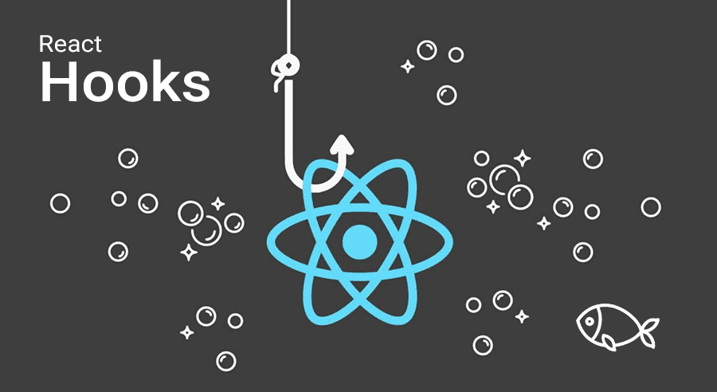
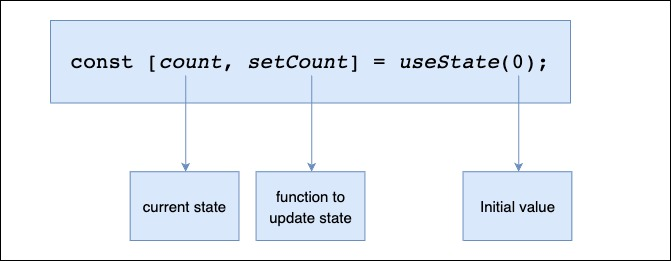
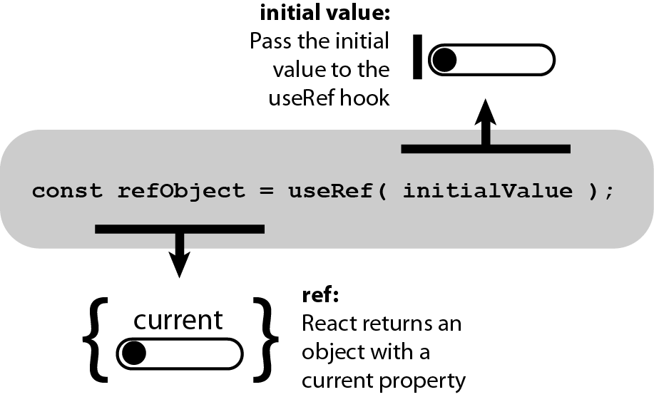
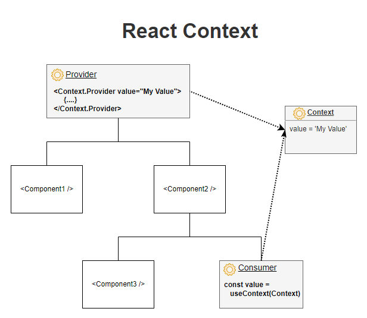

# Sesión 5 - Introducción a los Hooks de React: useState, useRef y useContext

## Que son los Hooks



Los Hooks son una API de React que nos permite tener estados, y otras características de React, en los componentes creados con una function.

Esto, antes, no era posible y nos obligaba a crear un componente con class para poder acceder a todas las posibilidades de la librería.

Hooks es gancho (en ingles) y, precisamente, lo que hacen, es que te permiten enganchar tus componentes funcionales a todas las características que ofrece React.

```jsx
import React, { useState } from "react";
import ReactDOM from "react-dom/client";

function FavoriteColor() {
    const [color, setColor] = useState("red");

    return (
        <>
            <h1>My favorite color is {color}!</h1>
            <button type="button" onClick={() => setColor("blue")}>
                Blue
            </button>
            <button type="button" onClick={() => setColor("red")}>
                Red
            </button>
            <button type="button" onClick={() => setColor("pink")}>
                Pink
            </button>
            <button type="button" onClick={() => setColor("green")}>
                Green
            </button>
        </>
    );
}
```

### Reglas de los Hooks

- Los hooks solo pueden ser llamados desde el nivel superior de un componente o desde otros hooks.
- Los hooks solo pueden ser llamados desde componentes funcionales o desde otros hooks.
- Los hooks solo pueden ser llamados desde el cuerpo principal de una función, no pueden ser llamados desde loops, condiciones o funciones anidadas.

## Hook useState



El hook useState es utilizado para crear variables de estado, quiere decir que su valor es dinámico, que este puede cambiar en el tiempo y eso requiere una re-renderización del componente donde se utiliza.

`const [ <nameState>, <setNameState> ] = useState(<initialState>)`

Recibe un parámetro:

- El valor inicial de la variable de estado.

Y devuelve un array con dos elementos:

- El valor de la variable de estado.
- Una función set que permite actualizar ese valor.

> **Nota:** Cabe destacar que la función proporciona cómo parámetro el valor actual del propio estado. Ex: `setIsOpen(isOpen => !isOpen)`

En este ejemplo mostramos como el valor de count se inicializa en 0, y también se renderiza cada vez que el valor es modificado con la función setCount en el evento onClick del button:

```jsx
import { useState } from "react";

function Counter() {
    const [count, setCount] = useState(0);

    return (
        <>
            <p>Contador: {count}</p>
            <button onClick={() => setCount((count) => count + 1)}>
                Aumentar
            </button>
        </>
    );
}
```

### Lifting State Up

Cuando varios componentes necesitan compartir los mismos datos de un estado, entonces se recomienda elevar ese estado compartido hasta su ancestro común más cercano.

Dicho de otra forma. Si dos componentes hijos comparten los mismos datos de su padre, entonces mueve el estado al padre en lugar de mantener un estado local en sus hijos.

Para entenderlo, lo mejor es que lo veamos con un ejemplo. Imagina que tenemos una lista de regalos deseados y queremos poder añadir regalos y mostrar el total de regalos que hay en la lista.

```jsx
import { useState } from "react";

export default function App() {
    return (
        <>
            <h1>Lista de regalos</h1>
            <GiftList />
            <TotalGifts />
        </>
    );
}

function GiftList() {
    const [gifts, setGifts] = useState([]);

    const addGift = () => {
        const newGift = prompt("¿Qué regalo quieres añadir?");
        setGifts([...gifts, newGift]);
    };

    return (
        <>
            <h2>Regalos</h2>
            <ul>
                {gifts.map((gift) => (
                    <li key={gift}>{gift}</li>
                ))}
            </ul>
            <button onClick={addGift}>Añadir regalo</button>
        </>
    );
}

function TotalGifts() {
    const [totalGifts, setTotalGifts] = useState(0);

    return (
        <>
            <h2>Total de regalos</h2>
            <p>{totalGifts}</p>
        </>
    );
}
```

¿Qué pasa si queremos que el total de regalos se actualice cada vez que añadimos un regalo? Como podemos ver, no es posible porque el estado de totalGifts está en el componente TotalGifts y no en el componente GiftList. Y como no podemos acceder al estado de GiftList desde TotalGifts, no podemos actualizar el estado de totalGifts cuando añadimos un regalo.

Tenemos que subir el estado de gifts al componente padre App y le pasaremos el número de regalos como prop al componente TotalGifts.

```jsx
import { useState } from "react";

export default function App() {
    const [gifts, setGifts] = useState([]);

    const addGift = () => {
        const newGift = prompt("¿Qué regalo quieres añadir?");
        setGifts([...gifts, newGift]);
    };

    return (
        <>
            <h1>Lista de regalos</h1>
            <GiftList gifts={gifts} addGift={addGift} />
            <TotalGifts totalGifts={gifts.length} />
        </>
    );
}

function GiftList({ gifts, addGift }) {
    return (
        <>
            <h2>Regalos</h2>
            <ul>
                {gifts.map((gift) => (
                    <li key={gift}>{gift}</li>
                ))}
            </ul>
            <button onClick={addGift}>Añadir regalo</button>
        </>
    );
}

function TotalGifts({ totalGifts }) {
    return (
        <>
            <h2>Total de regalos</h2>
            <p>{totalGifts}</p>
        </>
    );
}
```

Con esto, lo que hemos hecho es elevar el estado. Lo hemos movido desde el componente GiftList al componente App. Ahora pasamos como prop los regalos al componente GiftList y una forma de actualizar el estado, y también hemos pasado como prop al componente TotalGifts el número de regalos.

## Hook useRef



El hook useRef nos permite acceder al DOM de un elemento. Es decir, nos permite acceder a los elementos del DOM como si estuviéramos utilizando `document.querySelector()`.

Ademas de acceder al DOM, useRef nos permite mantener una referencia mutable que persiste durante todo el ciclo de vida del componente.

> **Nota:** querySelector() es un método de la API del DOM que permite seleccionar un elemento del DOM a partir de un selector CSS.

### Acceso a elementos del DOM

En general, queremos dejar que React maneje toda la manipulación de DOM, pero hay algunos casos donde `useRef` puede usarse sin causar problemas.

```jsx
import { useRef } from "react";

function TextInputWithFocusButton() {
    const inputEl = useRef(null);

    const onButtonClick = () => {
        // `current` apunta al elemento inputEl montado
        inputEl.current.focus();
    };

    return (
        <>
            <input ref={inputEl} type="text" />
            <button onClick={onButtonClick}>Focus the input</button>
        </>
    );
}
```

### Mantener una referencia mutable

`useRef` devuelve un objeto ref mutable cuya propiedad `.current` se inicializa con el argumento pasado (`initialValue`). El objeto devuelto se mantendrá persistente durante la vida completa del componente.

```jsx
import { useState, useEffect, useRef } from "react";

function App() {
    const [inputValue, setInputValue] = useState("");
    const count = useRef(0);

    useEffect(() => {
        count.current = count.current + 1;
    }, []);

    return (
        <>
            <input
                type="text"
                value={inputValue}
                onChange={(e) => setInputValue(e.target.value)}
            />
            <h1>Render Count: {count.current}</h1>
        </>
    );
}
```

### Seguir cambios en el estado

Los useRef Hook también se puede usar para realizar un seguimiento de los valores de estado anteriores. Esto se debe a que podemos usar `useRef` para persistir valores entre renders.

```jsx
import { useState, useEffect, useRef } from "react";

function App() {
    const [inputValue, setInputValue] = useState("");
    const previousInputValue = useRef("");

    useEffect(() => {
        previousInputValue.current = inputValue;
    }, [inputValue]);

    return (
        <>
            <input
                type="text"
                value={inputValue}
                onChange={(e) => setInputValue(e.target.value)}
            />
            <h2>Current Value: {inputValue}</h2>
            <h2>Previous Value: {previousInputValue.current}</h2>
        </>
    );
}
```

## Hook useContext



El hook useContext nos permite acceder al contexto de React desde cualquier componente de nuestra aplicación. Con este hook podemos evitar el Prop Drilling.

Con el hook useContext podemos crear un contexto global y acceder a él desde cualquier componente de nuestra aplicación.

> **Nota:** El Prop Drilling es un patrón de React que consiste en pasar props a través de componentes que no los necesitan para poder llegar a componentes que sí los necesitan.

### Crear un contexto

Para crear un contexto, utilizamos el método createContext() de React.

```jsx
import { createContext } from "react";

const MyContext = createContext(defaultValue);
```

El método createContext() recibe un parámetro:

- Un valor por defecto que será el valor del contexto si no se encuentra un proveedor para el contexto.
- Y devuelve un objeto con dos propiedades: `Provider` y `Consumer`.

Para usar el contexto, debemos envolver el árbol de componentes con el componente Provider:

```jsx

<MyContext.Provider value={10}>
    <App />
</MyContext.Provider>
```

Para consumir el contexto, debemos usar el hook useContext:

```jsx
import { useContext } from "react";

const value = useContext(MyContext);
```

## Actividad Practica


En esta ocasion vamos a intentar replicar un post de instagram, para ello vamos a utilizar los hooks que hemos visto en esta sesion.

Para ello usaremos los archivos que se encuentran en el directorio de resources, en el cual se encuentran los archivos de estilos y las imagenes que vamos a utilizar.
