# Sesión 6 - Hooks avanzados: useEffect para realizar llamadas a APIs externas con fetch y axios


## JavaScript síncrono

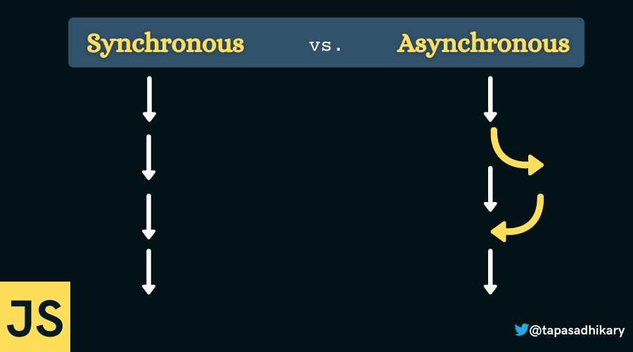

El JavaScript síncrono se refiere a la ejecución de código en un orden secuencial, donde cada instrucción se ejecuta una tras otra, esperando a que cada operación se complete antes de continuar con la siguiente. Esto puede llevar a bloqueos o retrasos en la ejecución si alguna operación lleva tiempo.

Por ejemplo tenemos 2 funciones que se ejecutan de forma síncrona:

```js
function acumulador(n) {
    let res = 0;
    for (let i = 0; i < n; i++) {
        res += i;
    }
    return res;
}

function sumar(a, b) {
  return a + b;
}

acumulador(100000);
console.log(sumar(2, 3));
```

En este caso, la función `acumulador` tarda un tiempo en ejecutarse, por lo que la función `sumar` no se ejecutará hasta que la función `acumulador` termine de ejecutarse.

## JavaScript Asíncrono


El JavaScript asíncrono se utiliza para manejar tareas que pueden llevar tiempo sin bloquear la ejecución del resto del código. Esto es crucial para realizar operaciones como solicitudes a servidores, lecturas/escrituras de archivos y otras operaciones de I/O. Los enfoques asincrónicos permiten que el programa continúe ejecutándose mientras se espera que estas operaciones se completen. En otros lenguajes de programación como Java, C# y Python, el soporte para operaciones asíncronas a menudo se implementa utilizando hilos o threads. Sin embargo, JavaScript no tiene soporte para hilos de forma nativa y, por lo tanto, utiliza un enfoque diferente para manejar operaciones asíncronas.

### Callbacks


Los callbacks son una forma de manejar operaciones asíncronas en JavaScript. Un callback es una función que se pasa como argumento a otra función y se ejecuta después de que se complete una operación asincrónica. Los callbacks se utilizan para manejar operaciones asíncronas en JavaScript desde hace mucho tiempo, pero tienen algunas limitaciones. Una de las limitaciones más importantes de los callbacks es que no son muy legibles y pueden generar un patrón conocido como callback hell. El callback hell se produce cuando se anidan múltiples callbacks dentro de otros callbacks, lo que puede hacer que el código sea difícil de leer y mantener.

La sintaxis de un callback es la siguiente:

```js
function callback() {
    // do something
}

function doSomethingAsync(callback) {
    // do something
    callback();
}
```

En el siguiente codigo, se muestra un ejemplo de callback hell:

```js
callEndpoint('api/getidbyusername/jhonnatan1806', function (results) {
    callEndpoint('api/getfollowersbyid' + results.userId, function (results) {
        callEndpoint('api/someothercall', function (results) {
            callEndpoint('api/someothercall', function (results) {
                callEndpoint('api/someothercall', function (results) {
                    callEndpoint('api/someothercall', function (results) {
                    // do things here
                    })
                })
            })
        })
    })
})
```

> **Nota:** El anidamiento excesivo siempre es una mala práctica, no solo en JavaScript. Siempre que sea posible, se debe evitar el anidamiento excesivo de funciones, callbacks, etc.

### Promesas

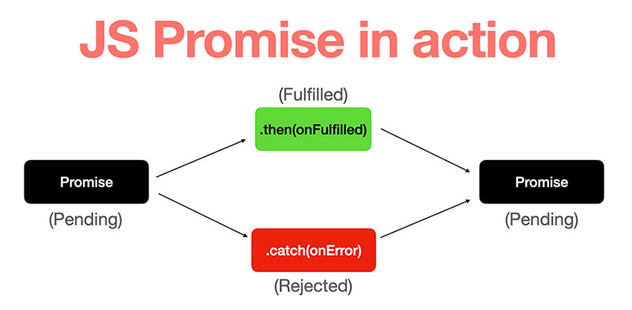

Las promesas llegan en ECMAscript 2016 como solución a uno de los problemas que generaba los callbacks, el callback hell. Lo que plantean las promesas es una mejor sintaxis ya que el codigo se vuelve mas vertical y se evita el anidamiento excesivo de callbacks.

Una promesa es un objeto que representa un valor que puede estar disponible ahora, en el futuro o nunca. Las promesas se utilizan para manejar operaciones asíncronas en JavaScript. Las promesas tienen dos resultados posibles: se resuelven o se rechazan. Una promesa se resuelve cuando se completa con éxito y se rechaza cuando ocurre un error.

Las promesas pueden estar en uno de los siguientes estados:

- **Pending**: Estado inicial, no cumplida o rechazada.
- **Fulfilled**: La operación se completó satisfactoriamente.
- **Rejected**: La operación falló.

Transiciones de estados:

- Una promesa puede pasar de "Pending" (Pendiente) a "Fulfilled" (Cumplida) cuando se resuelve con éxito.
- Una promesa puede pasar de "Pending" (Pendiente) a "Rejected" (Rechazada) cuando se rechaza explícitamente o si ocurre un error en la operación asincrónica.

La forma de crear una promesa es la siguiente:

```js
const promise = new Promise((resolve, reject) => {
    // do something
    if (/* everything turned out fine */) {
        resolve("Stuff worked!");
    } else {
        reject(Error("It broke"));
    }
});

// enfoque then(successHandler, errorHandler)
promise.then(
    result => {
        console.log(result); // "Stuff worked!"
    },
    error => {
        console.log(error); // Error: "It broke"
    }
);

// enfoque then(), catch() y finally()
promise.then(
    result => {
        console.log(result); // "Stuff worked!"
    }).catch(err => {
        console.log(err); // Error: "It broke"
    })
```

> **Nota:** Las promesas tienen un enfoque de programación funcional, lo que significa que no se pueden modificar una vez creadas.

En el siguiente codigo, se muestra un ejemplo de promesas:

```js
callEndpoint('api/getidbyusername/jhonnatan1806')
        .then(results => callEndpoint('api/getfollowersbyid' + results.userId))
        .then(results => callEndpoint('api/someothercall'))
        .then(results => callEndpoint('api/someothercall'))
        .then(results => callEndpoint('api/someothercall'))
        .then(results => callEndpoint('api/someothercall'))
        .then(results => {
            // do things here
        })
        .catch(err => {
            console.log(err);
        });
```

#### ¿Las promesas es solo sintaxis y funcionan igual que los callbacks?


No exactamente. Es cierto que las promesas manejan código que será ejecutado en algún futuro al igual que los callbacks. Nótese aquí la incertidumbre de cuándo será ejecutado este código. Sin embargo, la diferencia está en el mecanismo de las promesas. Las promesas son objetos que representan un valor que puede estar disponible ahora, en el futuro o nunca mientras que los callbacks son funciones que se ejecutarán en algún momento en el futuro.

### Async/Await

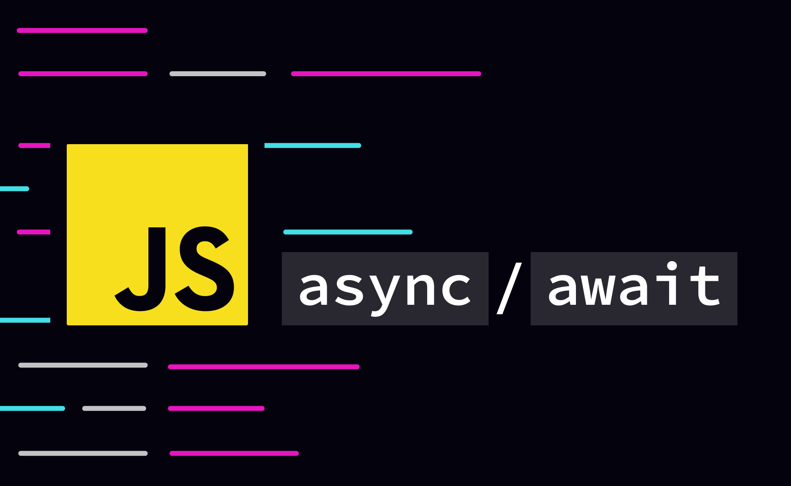

Async/Await es una característica introducida en ECMAScript 2017 que permite escribir código asincrónico como si fuera síncrono. Async/Await es una forma de escribir código asíncrono que es más fácil de leer y mantener que las promesas. La palabra clave `async` se usa para declarar una función asincrónica, y la keyword `await` se usa dentro de esa función para esperar el resultado de una operación asincrónica.

Este keyword permite que una promesa se resuelva y retorne su valor, esto permite que podamos guardarlo en variables. Pero no todo podía ser oro. `await` solo funciona en `async function`. Este tipo de funciones simplemente se aseguran que lo que sea que retornen sea una promesa. Dicho de otro modo, estas funciones siempre retornan una promesa.

La sintaxis de Async/Await es la siguiente:

```js
async function foo() {
    try {
        const result = await doSomethingAsync();
        return result; // stuff worked!
    } catch (error) {
        return Error(error); // it broke
    }
}

console.log(foo());
```

En el siguiente codigo, se muestra un ejemplo de Async/Await:

```js
async function foo() {
    try {
         const userResults = await callEndpoint('api/getidbyusername/jhonnatan1806')
        const followersResults = await callEndpoint('api/getfollowersbyid' + userResults.userId)
        const someResults = await callEndpoint('api/someothercall')
        const moreResults = await callEndpoint('api/someothercall')
        const anotherResults = await callEndpoint('api/someothercall')
        const finalResults = await callEndpoint('api/someothercall')
        // do things here
    } catch (error) {
        console.log(error);
    }
}
```

Después de ver la sintaxis creo que estamos de acuerdo que es mucho más simple y entendible de usar. Sin embargo, el manejo de async await es diferente a la de las promesas. El keyword `awai`t hace una pausa hasta que la promesa se resuelva. Literalmente, hace que la ejecución del `async function` espere hasta que la promesa se resuelva y retorne un valor, aúnque esto no detiene el engine del lenguaje, este aún puede ejecutar otros scripts o eventos, pero el `async function` no continuará hasta que la promesa se resuelva por lo tanto todo el código dentro de `async function` se ejecutará de forma síncrona.

### Async/Await con Promesas

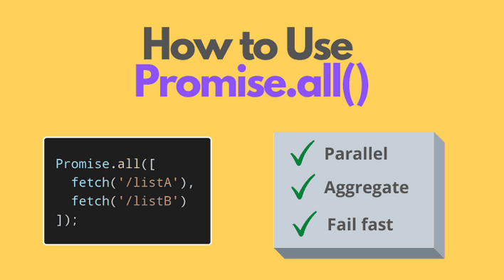

Una forma de utilizar las promesas con async/await es con el uso de la función `Promise.all()`. Esta función recibe un arreglo de promesas y retorna una promesa que se resuelve cuando todas las promesas del arreglo se resuelven. Esto es útil cuando se necesita esperar a que varias promesas se resuelvan antes de continuar con la ejecución del código.

La sintaxis de `Promise.all()` es la siguiente:

```js
const promise1 = new Promise((resolve, reject) => {
    setTimeout(resolve, 1000, 'one');
});

const promise2 = new Promise((resolve, reject) => {
    setTimeout(resolve, 2000, 'two');
});

const promise3 = new Promise((resolve, reject) => {
    setTimeout(resolve, 3000, 'three');
});

const promise4 = new Promise((resolve, reject) => {
    setTimeout(resolve, 4000, 'four');
});

const promise5 = new Promise((resolve, reject) => {
    reject(new Error('reject'));
});

Promise.all([promise1, promise2, promise3, promise4, promise5])
    .then(values => {
        console.log(values);
    })
    .catch(error => {
        console.log(error.message);
    });
```

Ahora nosotros podriamos utilizar `Promise.all()` para resolver el problema de las promesas con async/await:

Imaginemos que necesitamos obtener un usuario de un api y luego obtener los seguidores de ese usuario y las personas que sigue pero para obtener estos datos necesitamos el id del usuario. Para esto podemos utilizar `Promise.all()` para esperar a que se resuelvan ambas promesas y luego continuar con la ejecución del código.

```js
async function foo() {
    try {
        const response = await callEndpoint('api/getidbyusername/jhonnatan1806')
        const results = await Promise.all([
            callEndpoint('api/getfollowersbyid/' + response.userId),
            callEndpoint('api/getfollowingbyid/' + response.userId),
            callEndpoint('api/someothercall'),
            callEndpoint('api/someothercall'),
            callEndpoint('api/someothercall'),
        ]);
        // do things here
    } catch (error) {
        console.log(error);
    }
}
```

Las promesas y async await resuelven la asincronía de distinta forma. Con las promesas no sabemos cuándo se va a resolver y con async await forzamos una espera en la función. No siempre se va a usar uno, el otro o ambos, por ello lo primero es entender el caso de uso y después empezamos a implementar todo lo que hemos aprendido aquí.

## Ciclo de vida de un componente funcional

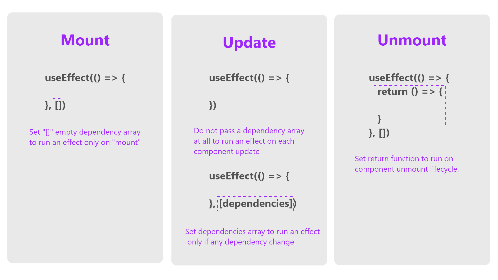

Cuando hablamos de ciclo de vida de un componente nos referimos a los diferentes estados por los que pasa un componente desde que se crea hasta que se destruye. En el caso de los componentes funcionales, el ciclo de vida se puede resumir en 3 estados:

- **Mount**: El componente se crea y se monta en el DOM.
- **Update**: El componente se actualiza cuando cambia el estado o las props.
- **Unmount**: El componente se desmonta y se elimina del DOM.

Para manejar el ciclo de vida de un componente funcional, React proporciona un Hook llamado `useEffect`. Este Hook permite ejecutar código en diferentes momentos del ciclo de vida de un componente funcional. El Hook `useEffect` se ejecuta después de que el componente se monta, se actualiza o se desmonta.

### Montaje de un componente funcional

El montaje de un componente funcional se produce cuando el componente se crea y se monta en el DOM. El Hook `useEffect` se ejecuta después de que el componente se monta en el DOM. Esto significa que el código dentro del Hook `useEffect` se ejecutará después de que el componente se monte en el DOM.

```jsx
import React, { useEffect } from 'react';

function App() {
    useEffect(() => {
        // do something
    }, []);

    return (
        <div>
            <h1>App</h1>
        </div>
    );
}
```

### Actualización de un componente funcional

La actualización de un componente funcional se produce cuando el componente se actualiza debido a un cambio en el estado o las props. El Hook `useEffect` se ejecuta después de que el componente se actualiza. Esto significa que el código dentro del Hook `useEffect` se ejecutará después de que el componente se actualice.

```jsx
import React, { useEffect, useState } from 'react';

function App() {
    const [count, setCount] = useState(0);

    useEffect(() => {
        // do something
    }, [count]);

    return (
        <div>
            <h1>App</h1>
            <p>Count: {count}</p>
            <button onClick={() => setCount(count + 1)}>Increment</button>
        </div>
    );
}
```

### Desmontaje de un componente funcional

El desmontaje de un componente funcional se produce cuando el componente se desmonta y se elimina del DOM. El Hook `useEffect` se ejecuta después de que el componente se desmonta. Esto significa que el código dentro del Hook `useEffect` se ejecutará después de que el componente se desmonte, sirve para limpiar recursos que se crearon en el montaje del componente como por ejemplo un `setInterval` o un `setTimeout`, llamadas a APIs externas, etc.

```jsx
import React, { useEffect } from 'react';

function App() {

    useEffect(() => {
        return () => {
            // do something
        };
    }, []);

    return (
        <div>
            <h1>App</h1>
        </div>
    );
}
```

## Hook UseEffect


### ¿Qué es useEffect?

`useEffect` es un Hook que permite ejecutar código en diferentes momentos del ciclo de vida de un componente funcional. El Hook `useEffect` se ejecuta después de que el componente se monta, se actualiza o se desmonta.

El Hook `useEffect` recibe dos parámetros:

- **Callback**: Función que se ejecuta después de que el componente se monta, se actualiza o se desmonta.
- **Dependencies**: Arreglo de dependencias que se utiliza para indicar cuándo se debe ejecutar el callback. Si el arreglo está vacío, el callback solo se ejecutará después del montaje del componente. Si el arreglo contiene elementos, el callback se ejecutará después del montaje del componente y cada vez que cambie el valor de una de las dependencias.

Tiene la siguiente sintaxis:

```jsx
useEffect(callback, [dependencies]);
```

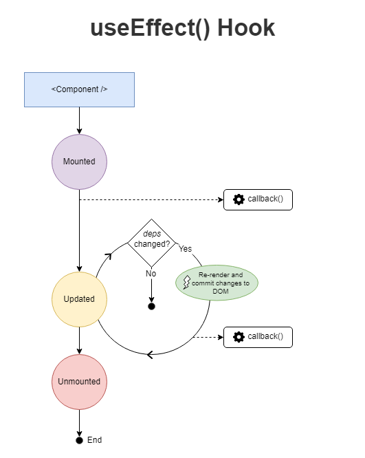

> **Nota:** Como ya hemos visto anteriormente, el uso de callbacks nos indica que estamos trabajando con código asíncrono.

### ¿Cuándo usar useEffect?

Podemos usar el hook useEffect de diferentes formas, tales como:

- Ejecutar código cuando se renderiza el componente, cuando cambian las dependencias del efecto o cuando se desmonta el componente.
- Realizar operaciones asíncronas como llamadas a APIs externas, lectura/escritura de archivos, etc.
- Suscribirse a eventos del navegador como el scroll, el resize, etc.
- Suscribirse a eventos de terceros como Firebase, Socket.io, etc.
- Realizar tracking de eventos con Google Analytics, Facebook Pixel, etc.
- Realizar operaciones de limpieza como limpiar un intervalo, un timeout, etc.
- Validar un formulario antes de enviarlo.

### ¿Cómo usar useEffect?

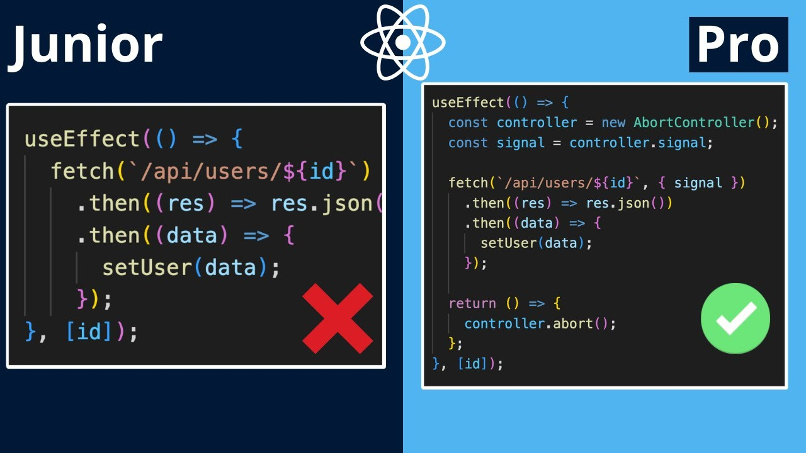

Generalmente, el Hook `useEffect` se utiliza para realizar operaciones asíncronas como llamadas a APIs externas, lectura/escritura de archivos, etc. Un ejemplo de uso de `useEffect` es el siguiente:

```jsx
import { useEffect, useState } from 'react'

function Counter() {
    const [count, setCount] = useState(0)

    userEffect(() => {
        console.log('El componente se ha montado')
        
        return () => {
            console.log('El componente se ha desmontado')
        }
    },[])

    useEffect(() => {
        console.log('El componente se ha actualizado')
    }, [count])

    return (
    <>
        <p>Contador: {count}</p>
        <button onClick={() => setCount(count + 1)}>Aumentar</button>
    </>
    )
}
```

### Como suscribirse a eventos del navegador

Dentro de useEffect nos podemos suscribir a eventos del navegador, como el evento resize para saber cuando el usuario cambia el tamaño de la ventana. Es importante que nos desuscribamos cuando el componente se desmonte para evitar fugas de memoria. Para ello, tenemos que devolver una función dentro del useEffect que se ejecutará cuando el componente se desmonte.

```jsx
import { useEffect } from 'react'

function App() {

    useEffect(() => {

    const handleResize = () => {
        console.log('La ventana se ha redimensionado')
    }

    window.addEventListener('resize', handleResize)

    return () => {
        window.removeEventListener('resize', handleResize)
    }
    }, [])

    return (
        <p>Abre la consola y redimensiona la ventana</p>
    )
}
```

## Conceptos de API y Herramientas para Solicitudes HTTP

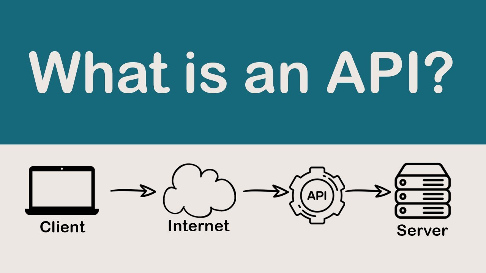

### ¿Qué es una API?

Una API (Application Programming Interface) es un conjunto de funciones y procedimientos que permiten la creación de aplicaciones que acceden a las características o datos de una aplicación, servicio o sistema operativo. Consiste en una serie de rutinas que ofrecen ciertas funcionalidades para ser utilizadas por otro software como una capa de abstracción.

### ¿Qué es una REST API?

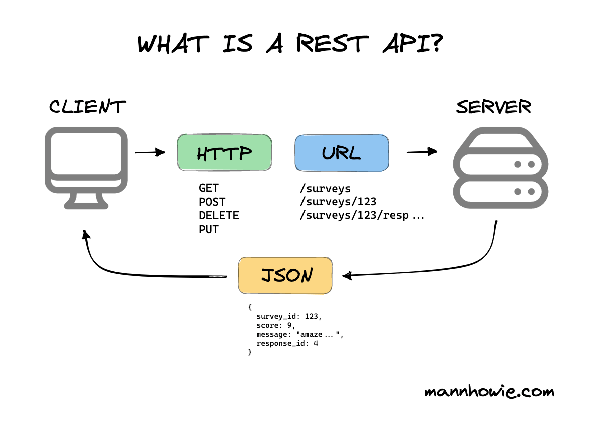

REST (Representational State Transfer) es un estilo de arquitectura de software estandarizada que establece un conjunto de principios y restricciones para el diseño y desarrollo de aplicaciones web y servicios. Las aplicaciones que siguen los principios de REST se denominan aplicaciones RESTful. Una API REST es un conjunto de puntos finales (URLs) que permiten a las aplicaciones interactuar entre sí a través de HTTP utilizando los principios de REST.

### Principios de REST

- **Interfaz uniforme:** REST define una interfaz uniforme que consiste en métodos HTTP estándar (GET, POST, PUT, DELETE) para realizar operaciones en recursos. Cada recurso se identifica mediante una URL única.
- **Sin estado:** Las peticiones a un servidor REST contienen toda la información necesaria para comprender y procesar la solicitud. El servidor no guarda información sobre el estado de la aplicación entre peticiones.
- **Cacheable:**  REST permite el uso de caché para mejorar la eficiencia. Las respuestas del servidor pueden etiquetarse para indicar si pueden ser almacenadas en caché o no.
- **Sistema en capas:**  REST permite la escalabilidad al separar los componentes en capas independientes. Cada capa realiza una función específica y no necesita conocer los detalles internos de las otras capas.
- **Código bajo demanda:** Este principio es opcional y permite que el servidor envíe ejecutables (por ejemplo, JavaScript) al cliente para extender la funcionalidad del cliente.
- **Representación de recursos:**  Los recursos, que son entidades clave en REST, se identifican mediante URLs. Las representaciones de esos recursos pueden ser en diferentes formatos como JSON, XML, HTML, etc.

### Metodos HTTP

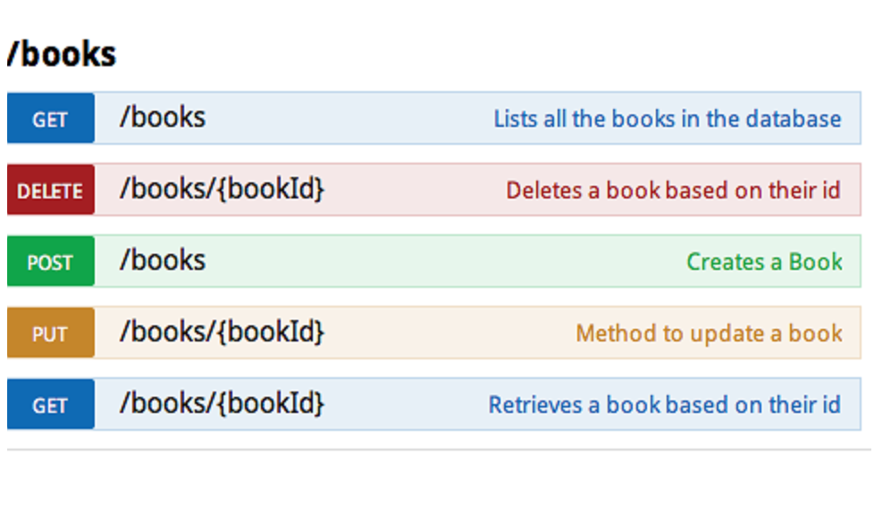

Los métodos HTTP indican la acción que se debe realizar en un recurso. Los métodos HTTP más comunes son los siguientes:

- **GET:** El método GET solicita una representación de un recurso específico. Las peticiones que usan el método GET solo deben recuperar datos.
- **POST:** El método POST se utiliza para enviar una entidad a un recurso en específico, causando a menudo un cambio en el estado o efectos secundarios en el servidor.
- **PUT:** El modo PUT reemplaza todas las representaciones actuales del recurso de destino con la carga útil de la petición.
- **DELETE:** El método DELETE borra un recurso en específico.

### Códigos de estado HTTP

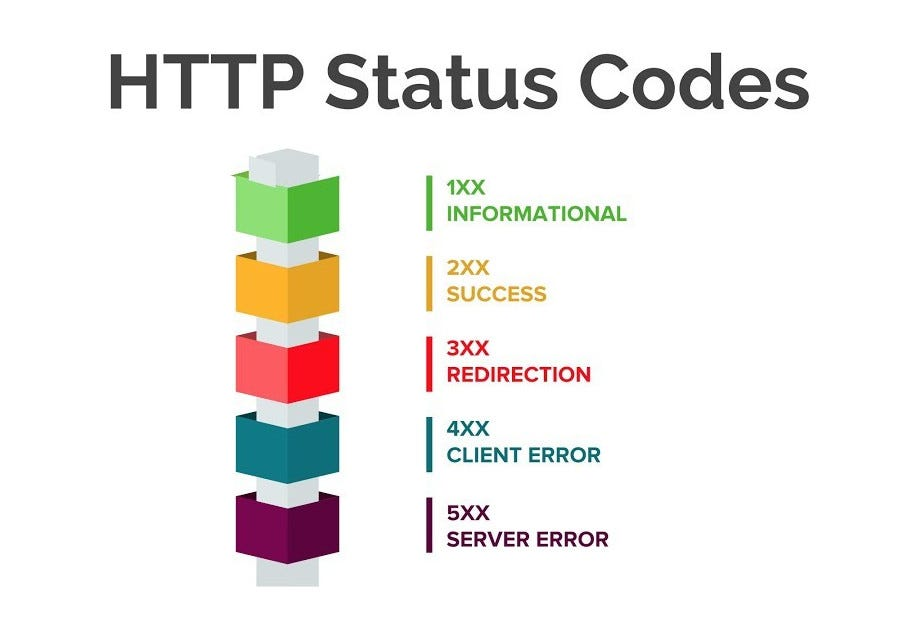

Cuando trabajamos con aplicaciones web, es muy común que nos encontremos con códigos de estado HTTP. Estos códigos de estado son números que se envían en las respuestas del servidor para indicar el estado de la solicitud. Los códigos de estado HTTP se dividen en 5 categorías:

- **1xx:** Respuestas informativas.
- **2xx:** Respuestas satisfactorias.
- **3xx:** Redirecciones.
- **4xx:** Errores del cliente.
- **5xx:** Errores del servidor.

### Uso de Fetch en React

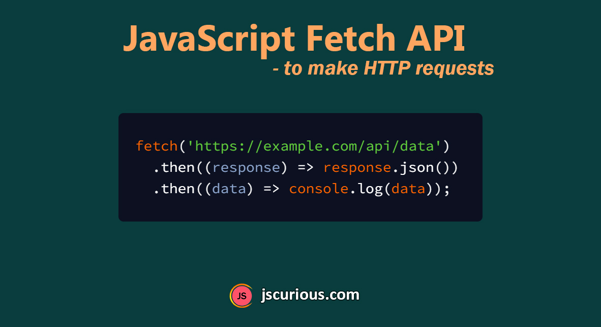

El uso de la función fetch en React es una técnica común para realizar solicitudes de red y obtener datos de servidores remotos. La función fetch está disponible en la mayoría de los navegadores y permite realizar solicitudes HTTP asincrónicas.

Realización de una solicitud con Fetch:

```jsx
import React, { useState, useEffect } from 'react';

function App() {
    const [data, setData] = useState(null);

    // enfoque then()
    useEffect(() => {
        fetch(url)
            .then(response => response.json())
            .then(data => setData(data));
    }, []);

    // enfoque async/await
    useEffect(() => {
        const fetchData = async () => {
            const response = await fetch(url);
            const data = await response.json();
            setData(data);
        };
        fetchData();
    }, []);

    return (
        <div>
            <h1>App</h1>
            {data && <p>{data.name}</p>}
        </div>
    );
}
```

### Manejo de errores con Fetch

Cuando se utiliza fetch para realizar solicitudes de red, es importante considerar cómo manejar los posibles errores que puedan surgir durante el proceso. Se puede manejar errores de diferentes maneras, como capturando excepciones en un bloque try/catch o utilizando el método .catch() en la cadena de promesas.

#### Manejo de errores con try/catch

Al utilizar el enfoque async/await, se puede utilizar un bloque try/catch para manejar los errores que puedan surgir durante el proceso de solicitud. El bloque try/catch permite capturar excepciones y manejarlas de forma adecuada.

```jsx
useEffect(() => {
    const fetchData = async () => {
        try {
            const response = await fetch(url);
            if (!response.ok) { // Codigos de estado 4xx y 5xx
                throw new Error('Error al obtener los datos');
            }
            const data = await response.json();
            setData(data);
        } catch (error) {
            console.error('Error:', error);
        }
    };
    fetchData();
}, []);
```

#### Manejo de errores con .catch()

Al utilizar el enfoque then(), se puede utilizar el método .catch() para manejar los errores que puedan surgir durante el proceso de solicitud. El método .catch() permite capturar errores y manejarlos de forma adecuada.

```jsx
useEffect(() => {
    fetch(url)
        .then(response => {
            if (!response.ok) { // Codigos de estado 4xx y 5xx
                throw new Error('Error al obtener los datos');
            }
            return response.json();
        })
        .then(data => setData(data))
        .catch(error => {
            console.error('Error:', error);
        });
}, []);
```

## Actividad Practica

Vamos a hacer una peticion fetch a la API de [rickandmortyapi.com](https://rickandmortyapi.com/) para obtener los personajes de la serie Rick and Morty y mostrarlos en pantalla.


### Pasos

#### 1. Crear el proyecto

```bash
npm create vite@latest react-rick-and-morty
```

#### 2. Instalar dependencias

```bash
npm install prettier eslint-config-prettier -D
npm install tailwindcss postcss autoprefixer -D
```

#### 3. Configurar TailwindCSS

Escribir en la terminal:

```bash
npx tailwindcss init -p
```

Configurar el tailwind.config.js

```js
/** @type {import('tailwindcss').Config} */
export default {
    content: [
        "./index.html",
        "./src/**/*.{js,ts,jsx,tsx}",
    ],
    theme: {
        extend: {},
    },
    plugins: [],
}
```

Escribir en el index.css

```css
@tailwind base;
@tailwind components;
@tailwind utilities;
```

#### 4. Configurar Prettier

Crear el archivo .prettierrc

```json
{
    "tabWidth": 4,
    "useTabs": true,
    "semi": false,
    "singleQuote": true,
    "jsxSingleQuote": false,
    "trailingComma": "none",
    "bracketSpacing": true,
    "jsxBracketSameLine": true,
}
```

Agregar prettier al eslint.config.js y desactivar type prop en los componentes de React

```js
module.exports = {
    extends: ['prettier'],
    rules: {
        'react/prop-types': 'off',
    },
};
```

