# Sesión 7 - Despliegue de aplicaciones React en Netlify, Extra: Responsividad con TailwindCSS

## Netlify


Netlify es una plataforma de alojamiento y automatización de sitios web que simplifica el proceso de publicación de sitios web. Netlify es una plataforma de alojamiento y automatización de sitios web que simplifica el proceso de publicación de sitios web. Netlify es una plataforma de alojamiento y automatización de sitios web que simplifica el proceso de publicación de sitios web.

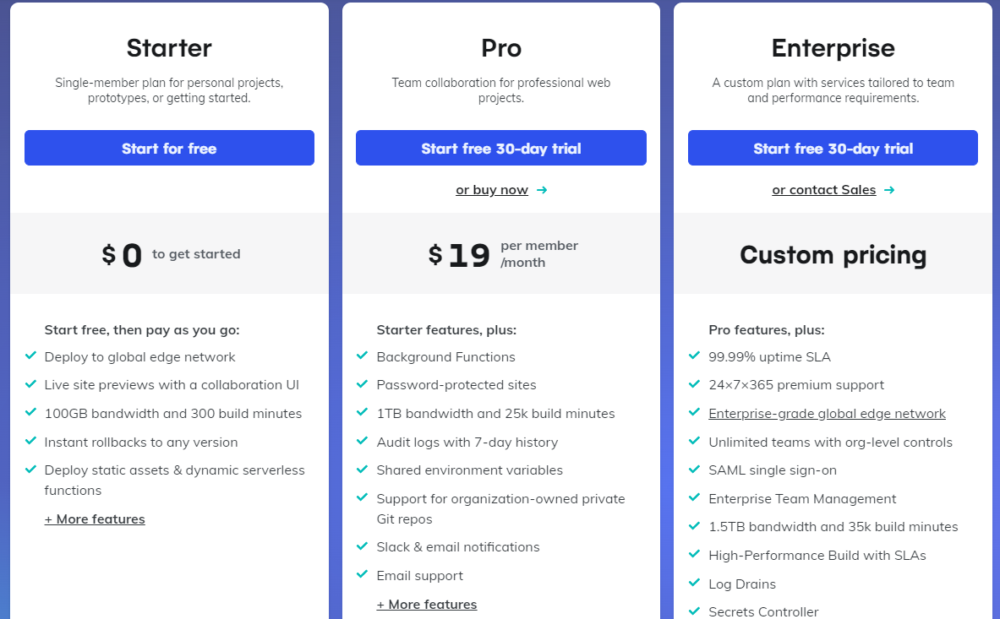

El plan gratuito es más que suficiente para nuestras necesidades.

El plan grauito nos permite:

- 100 GB de ancho de banda por mes (mas que suficiente para nuestras aplicaciones).
- 300 minutos de tiempo de compilación por mes (para proyectos de código abierto).
- Previsualización de ramas.
- Rollbacks de despliegues en un click.
- Integración con GitHub, GitLab, Bitbucket y Azure.
- 500 sitios web por equipo.
- 1 usuario por equipo.
- 100 formularios por sitio web.
- Entre otras cosas.

### Crear una cuenta en Netlify

Para crear una cuenta en Netlify, debemos ir a [netlify.com](https://www.netlify.com/) y hacer click en el botón `Sign up`.

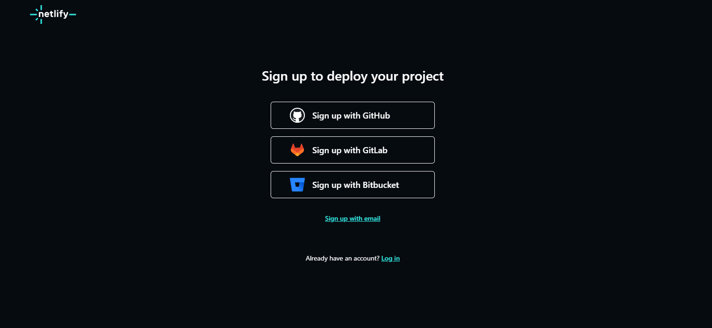

Luego seleccionaremos la opción `GitHub`.

Y nos loguearemos con nuestra cuenta de GitHub o podemos usar la opción `Sign up with email`.

### Desplegar un sitio web en Netlify

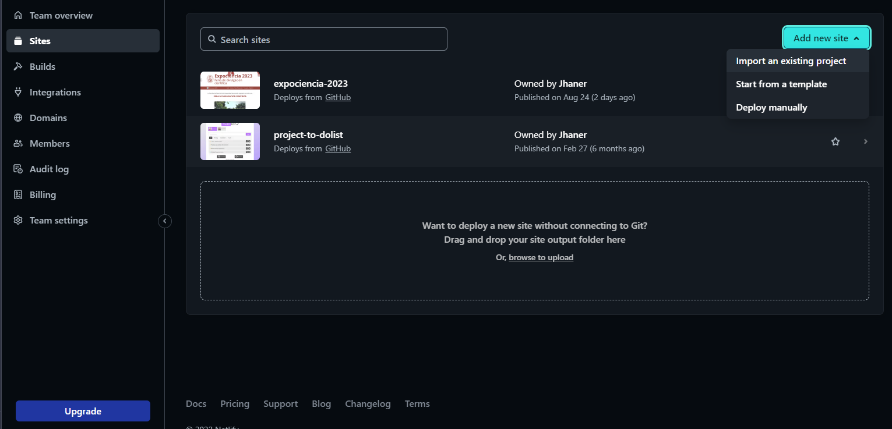

Para desplegar un sitio web en Netlify, debemos ir a la sección `Sites` y hacer click en el botón `Add new site` y seleccioanremos `import an existing project`.

Luego seleccionaremos la opcion `GitHub` o la opcion que usemos para alojar nuestro proyecto, nos loguearemos con nuestra cuenta correspondiente y nos perdira que seleccionemos el repositorio que queremos desplegar.

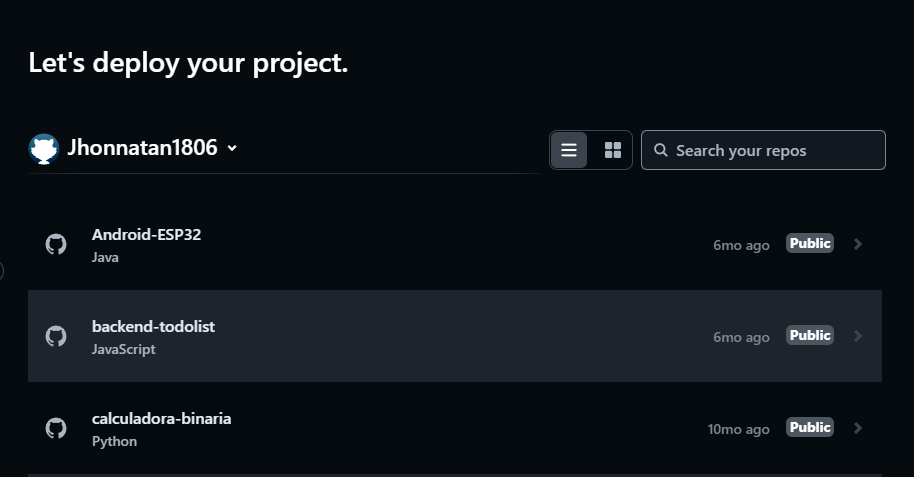

Luego de seleccionar el repositorio, nos pedira que configuremos el proyecto.

### Configurar el proyecto

- **Team**: Seleccionaremos la opción `Personal`.
- **branch to deploy**: Seleccionaremos la rama que queremos desplegar, en este caso `main`.
- **base directory**: Seleccionaremos la carpeta donde se encuentra nuestro proyecto, en caso este en la raiz, dejaremos el campo vacio.
- **build command**: Aqui pondremos el comando que se encarga de compilar nuestro proyecto, en el caso de React, el comando es `npm run build` o el comando que tengamos en nuestro `package.json` para compilar nuestro proyecto.
- **publish directory**: Aqui pondremos la carpeta donde se encuentra nuestro proyecto compilado, en el caso de React, la carpeta es `dist` o la carpeta que tengamos en nuestro `package.json` para compilar nuestro proyecto.
- **functions directory**: Aqui pondremos la carpeta donde se encuentra nuestras funciones, estas funciones son funciones que se ejecutan en el servidor, en el caso de React, no usaremos esta opción.
- **Add environment variables**: Aqui pondremos las variables de entorno que usemos en nuestro proyecto, en el caso usemos alguna API KEY o alguna variable de entorno que usemos en nuestro proyecto podemos ponerla aqui.

Finalmente con esto podemos hacer click en el botón `Deploy site` y esperar a que nuestro proyecto se despliegue.

## Diseño Web

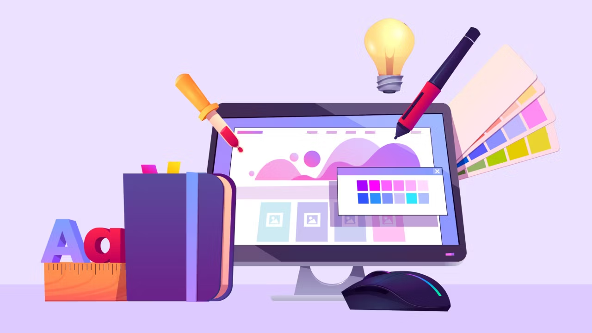

### Desktop first design

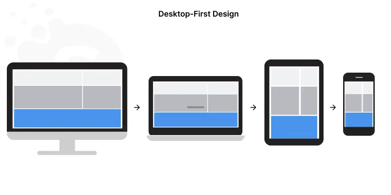

El "Diseño Desktop-First" es un enfoque que prioriza el diseño y la codificación teniendo en cuenta los dispositivos de escritorio. Implica crear un diseño de sitio web, diseño y experiencia de usuario optimizados para las pantallas más grandes de las computadoras de escritorio y laptops.

Estas soluciones involucran diseños complejos con múltiples columnas e interacciones avanzadas como efectos al pasar el mouse. Además, a menudo incluyen elementos que podrían no funcionar bien en dispositivos móviles, como ventanas emergentes y gráficos grandes. Los diseñadores pueden utilizar el espacio adicional para mostrar versiones con más contenido y características.

Para el diseño Desktop-First, los especialistas suelen utilizar herramientas y software más sofisticados, como Adobe Photoshop e Illustrator.

Algunos ejemplos famosos de sitios web Desktop-First incluyen TechCrunch, Forbes, Microsoft, Coca-Cola y Rolex.

### Mobile first design

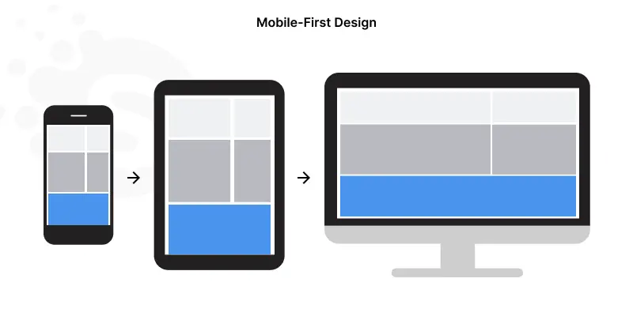

El Diseño Móvil Primero es un enfoque que prioriza construir soluciones para dispositivos móviles sobre las computadoras de escritorio. Dado que los dispositivos móviles generan la mayor parte del tráfico de sitios web, los diseñadores deben proporcionar la mejor experiencia de usuario para este segmento de audiencia masiva.

Las últimas estadísticas demuestran que el enfoque Móvil Primero tiene sentido. Según el Informe Global de Panorama Digital 2023, el 92.3% de los usuarios se conectan en línea a través de dispositivos móviles, un 0.2% más que en 2022.

El diseño centrado en dispositivos móviles implica diseños simples, tipografía clara y legible, y una navegación fácil de usar. Está optimizado para pantallas pequeñas e interacciones basadas en el tacto.

Los diseñadores que utilizan el enfoque Móvil Primero confían en software y herramientas como Sketch, Adobe XD o Figma. Construyen soluciones adaptadas a diferentes tamaños de pantalla y resoluciones. En Softermii, contribuimos a la Comunidad de Figma con recursos de diseño gratuitos.

Algunos ejemplos de sitios web con diseño Móvil Primero incluyen Airbnb, Etsy, Spotify, Uber, Instagram y Snapchat.

### Diseño web adaptable

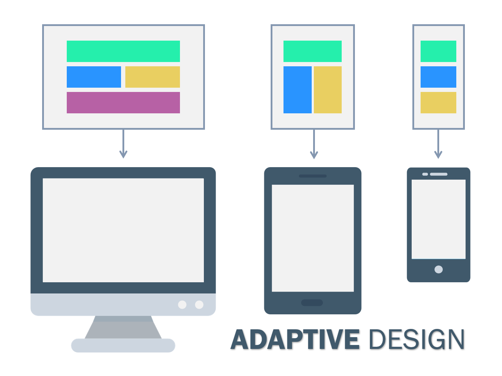

El diseño web adaptativo, también conocido como diseño basado en puntos de quiebre (breakpoints), se basa en definir puntos específicos de ancho de pantalla en los cuales el diseño cambia para adaptarse a ese tamaño en particular.

Se crean múltiples diseños diferentes para diferentes resoluciones de pantalla (por ejemplo, uno para dispositivos móviles, otro para tabletas y otro para computadoras de escritorio). Luego, el diseño apropiado se aplica automáticamente según el tamaño de la pantalla del dispositivo.

### Diseño web responsivo

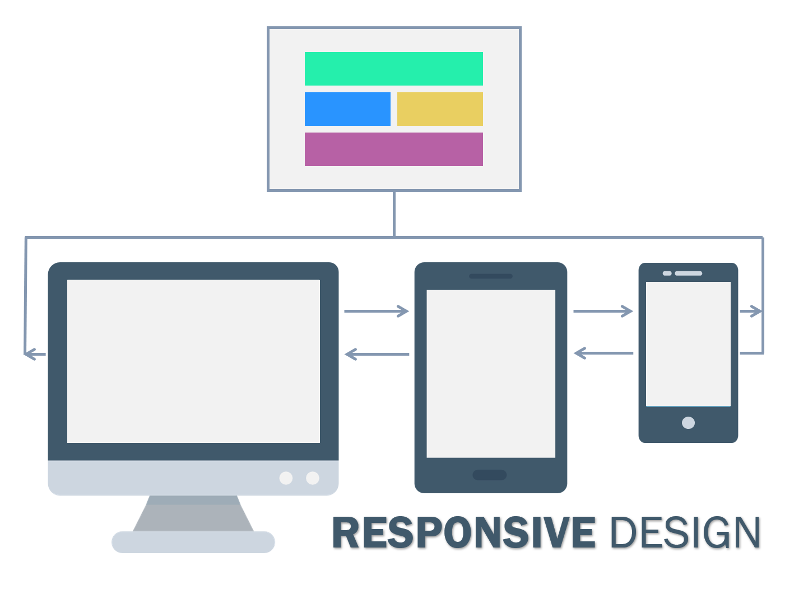

El diseño web responsive utiliza un enfoque fluido y flexible para adaptar el diseño y el contenido del sitio web según el tamaño de la pantalla del dispositivo.

Los elementos del diseño, como imágenes, columnas y bloques de texto, se ajustan proporcionalmente y cambian de posición para acomodar diferentes resoluciones de pantalla.

### Diferencias entre diseño web adaptable y diseño web responsivo

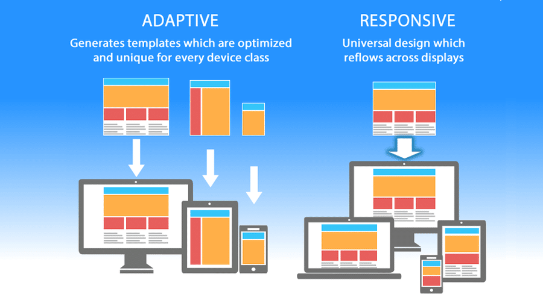

Diseño adaptativo frente a diseño responsivo: 5 diferencias
Tanto el diseño adaptativo como el diseño responsivo satisfacen las necesidades de escalabilidad de los usuarios, pero difieren en cinco categorías importantes:

#### Diseño

- **Responsivo:** El dispositivo o la ventana del navegador dictan la forma en que se muestra un único diseño. El diseño de la experiencia de usuario se adapta a Chrome, Bing, Firefox y Safari, así como a Windows, macOS, Linux u otros sistemas operativos.
- **Adaptativo:** El dispositivo o el navegador del cliente predeterminan qué diseño se debe mostrar. El servidor detecta factores como el tipo de dispositivo y el sistema operativo, y envía la configuración correcta.

#### Tiempo de carga

- **Responsivo:** Aunque moderadamente más lento que los diseños adaptativos, la mayoría del software de creación de sitios web proporciona funciones que aceleran los diseños responsivos. Estas permiten que las imágenes estáticas y dinámicas se escalen automáticamente para adaptarse a cada dispositivo y resolución.
- **Adaptativo:** En general, se considera que los diseños adaptativos son más rápidos porque solo los activos necesarios se transfieren a cada dispositivo. Estos diseños son aún más rápidos cuando se ven en una pantalla de alta calidad, lo que permite cargar las imágenes más rápido.

#### Dificultad

- **Responsivo:** Con solo un diseño en todos los dispositivos, los diseños responsivos requieren más trabajo inicial. Esto incluye prestar atención adicional a la organización de CSS para garantizar la funcionalidad en todas las pantallas.
- **Adaptativo:** Cada clase de dispositivo necesita su propio diseño, por lo que hay más trabajo en general. Puedes utilizar los mismos elementos en los diseños, pero aún así debes diseñar cada uno por separado.

#### Flexibilidad

- **Responsivo:** Al igual que todos los sitios web, los sitios web responsivos necesitan un mantenimiento general. Sin embargo, los diseños responsivos no necesitan actualizarse cuando el mercado ofrece nuevas pantallas.
- **Adaptativo:** Los tamaños de pantalla y las resoluciones cambian constantemente. Los diseños adaptativos pueden "romperse" cuando no están optimizados para la resolución de una pantalla. Debes crear nuevos diseños con frecuencia para tener en cuenta la tecnología en constante cambio.

#### Amigabilidad con SEO

- **Responsivo:** Google recomienda y premia a los sitios que utilizan diseño responsivo. Los sitios web compatibles con dispositivos móviles tienden a tener un mejor ranking en las páginas de resultados del motor de búsqueda (SERP), ya que la mitad del tráfico proviene de teléfonos móviles.
- **Adaptativo:** Los diseños adaptativos son complicados en cuanto al SEO, ya que debes actualizar y optimizar cada diseño por separado.

### Media queries

Las media queries son una característica de CSS3 que nos permite aplicar estilos dependiendo de las características del dispositivo donde se esta visualizando el sitio web.

Las media queries nos permiten aplicar estilos dependiendo de:

- Ancho y alto de la pantalla.
- Orientación de la pantalla.

Ejemplo de media queries

```css
/* Estilos para pantallas con un ancho menor a 768px */
@media (max-width: 768px) {
  .container {
    width: 100%;
  }
}

/* Estilos para pantallas con un ancho mayor a 768px */
@media (min-width: 768px) {
  .container {
    width: 768px;
  }
}
```

### Responsive y Adaptive con TailwindCSS

En todos los proyectos realizados en el curso hemos usado TailwindCSS y React, pero no hemos visto como hacer que nuestros proyectos sean responsivos ni adaptativos. Tailwind nos provee de varias clases para hacer que nuestros proyectos se adapten a diferentes tamaños de pantalla.

Para esto debemos usar las clases que nos provee TailwindCSS para hacer que nuestros proyectos sean responsivos, estas clases son:

- `sm`: Para pantallas con un ancho mayor a 640px.
- `md`: Para pantallas con un ancho mayor a 768px.
- `lg`: Para pantallas con un ancho mayor a 1024px.
- `xl`: Para pantallas con un ancho mayor a 1280px.
- `2xl`: Para pantallas con un ancho mayor a 1536px.
- `landscape`: Para pantallas en modo horizontal.

La idea es trabajar de un modo mobile first, es decir, primero haremos que nuestro proyecto se vea bien en pantallas pequeñas y luego iremos agregando estilos para pantallas mas grandes.

Ejemplo de responsive con TailwindCSS

```html
<div class="container mx-auto">
  <div class="flex flex-row md:flex-col">
    <div class="w-1/2 md:w-1/3 lg:w-1/4">
      
    </div>
  </div>
</div>
```

#### Grid Layout

Tailwind nos provee de una tecnica para hacer que nuestros proyectos sean responsive de una manera muy sencilla, esta tecnica es la tecnica de `grid cols`.

La tecnica de `grid cols` nos permite hacer que nuestros proyectos sean responsive de una manera muy sencilla, esta tecnica consiste en usar las clases `grid-cols-1`, `grid-cols-2`, `grid-cols-3`, `grid-cols-4`, `grid-cols-5`, `grid-cols-6`, `grid-cols-7`, `grid-cols-8`, `grid-cols-9`, `grid-cols-10`, `grid-cols-11`, `grid-cols-12` para hacer que nuestros elementos se distribuyan en una grilla de 1 a 12 columnas.

El uso de la técnica grid cols con las clases grid-cols-X permite una distribución clara y fácil de los elementos en columnas, lo que es particularmente útil para diseños en los que el contenido se organiza en filas y columnas, como una rejilla. Esta técnica es especialmente efectiva para diseños que requieren un control preciso sobre la colocación de elementos.

Usualmente para Desktop usamos una grilla de 12 columnas, para Tablets usamos una grilla de 8 columnas y para Mobile usamos una grilla de 4 columnas.

Diseño Tablet

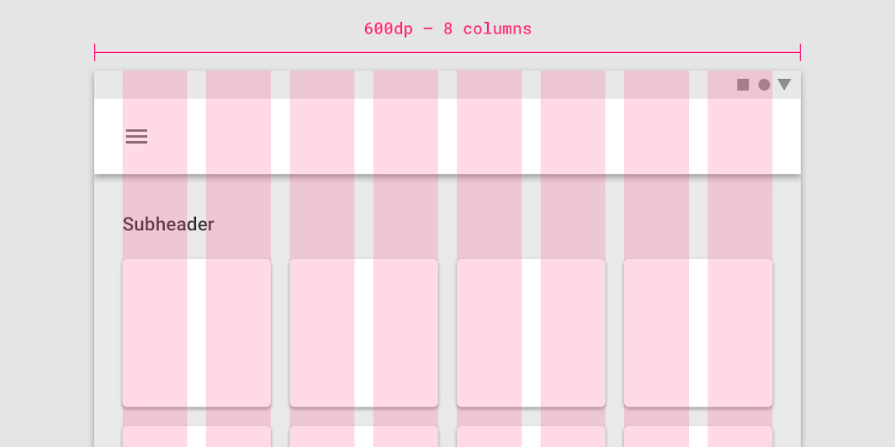

Diseño Mobile

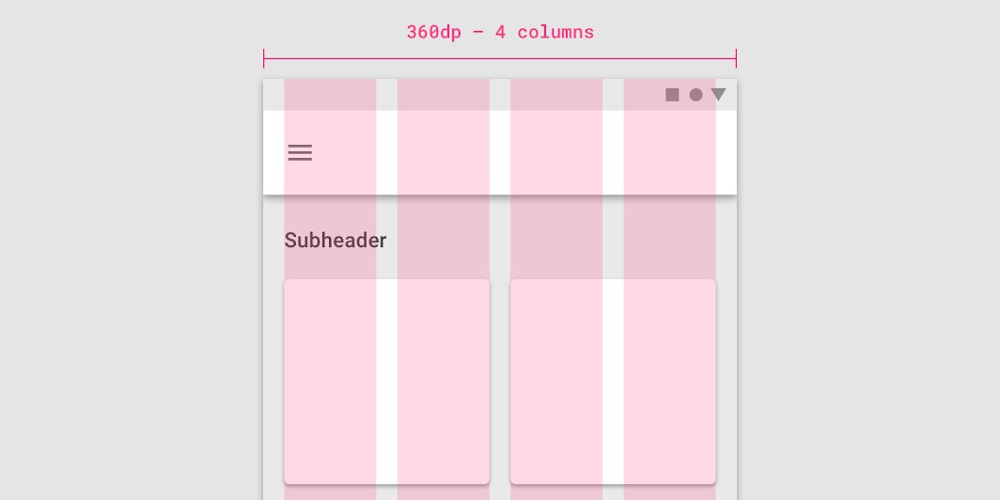

Mas info: [https://m2.material.io/design/layout/responsive-layout-grid.html](https://m2.material.io/design/layout/responsive-layout-grid.html)

Podemos combinar las clases `grid-cols-X`, con las clases `sm`, `md`, `lg` para hacer que nuestros proyectos sean responsive.

Ejemplo de grid responsive

```html
<div class="container mx-auto">
  <div class="grid grid-cols-4 md:grid-cols-8 lg:grid-cols-12">
    <div class="col-span-3 bg-gray-200 p-4 md:col-span-5 lg:col-span-7">1</div>
    <div class="col-span-1 bg-cyan-200 p-4 md:col-span-3 lg:col-span-5">2</div>
    <div class="col-span-2 bg-red-200 p-4 md:col-span-2 lg:col-span-8">3</div>
    <div class="col-span-2 bg-yellow-200 p-4 md:col-span-6 lg:col-span-4">4</div>
  </div>
</div>

```

#### Flex Layout

El enfoque flex proporciona una forma versátil de controlar el flujo y la alineación de los elementos, lo que puede ser beneficioso cuando deseas que los elementos se adapten de manera más dinámica y flexible a diferentes tamaños de pantalla y disposiciones. La clase flex-grow es especialmente útil para permitir que ciertos elementos crezcan y ocupen espacio adicional de manera proporcional.

Tailwind nos provee clases para crear diseños responsivos con flex algunas de ellas son: `flex`, `flex-row`, `flex-col`, `flex-wrap` y `flex-grow`.

- **Display flex:** La clase `flex` nos permite usar flexbox para alinear los elementos de nuestro contenedor.
- **Flex direction:** La clase `flex-row` nos permite alinear los elementos de nuestro contenedor de manera horizontal. La clase `flex-col` nos permite alinear los elementos de nuestro contenedor de manera vertical.
- **Flex wrap:** La clase `flex-wrap` nos permite que los elementos de nuestro contenedor se distribuyan en varias lineas.
- **Flex grow:** La clase `flex-grow` nos permite que nuestros elementos crezcan para ocupar todo el espacio disponible.

Ejemplo de flex responsive con TailwindCSS

```html
<div class="container mx-auto">
  <div class="flex flex-row flex-wrap">
    <div class="bg-gray-200 p-4">1</div>
    <div class="flex-grow bg-cyan-200 p-4">2</div>
    <div class="bg-red-200 p-4">3</div>
    <div class="bg-yellow-200 p-4">4</div>
  </div>
  <div class="flex flex-row">
    <div class="bg-gray-200 p-4">1</div>
    <div class="bg-cyan-200 p-4">2</div>
    <div class="bg-red-200 p-4">3</div>
    <div class="bg-yellow-200 p-4">4</div>
  </div>
</div>

```

> Entre flex y grid ambas son buenas opciones para hacer que nuestros proyectos sean responsive, pero en mi opinion personal, prefiero usar flex para diseños rapidos y una combinacion de grid y flex para diseños mas complejos.
